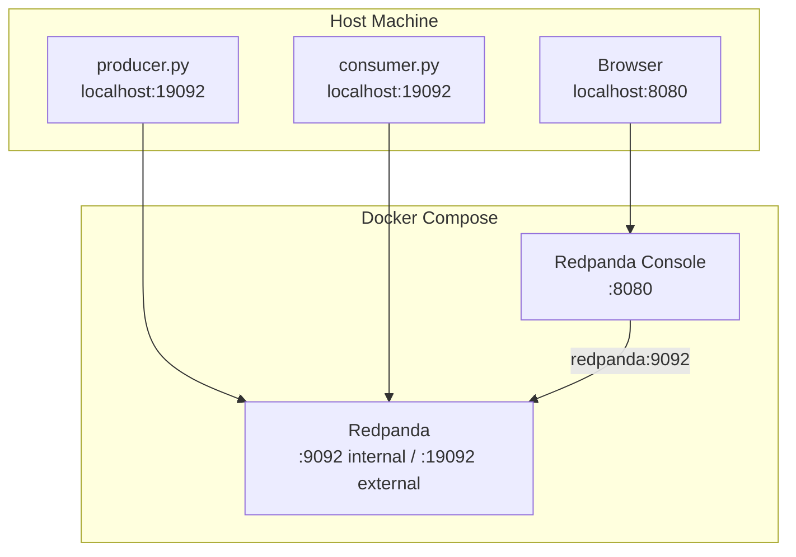

# Part 3 — Infrastructure

[← Back to Index](../README.md)

---

| Chapter | Topic | One-liner |
|---------|-------|-----------|
| 12 | [Redpanda](./redpanda.md) | Ports, internal vs external, rpk CLI |
| 13 | [Redpanda Console](./redpanda-console.md) | Web UI, Protobuf decoding, debugging guide |
| 14 | [Python Packages](./python-packages.md) | confluent-kafka, protobuf, librdkafka |

---

**[→ Start with Chapter 12: Redpanda](./redpanda.md)**

## Architecture

