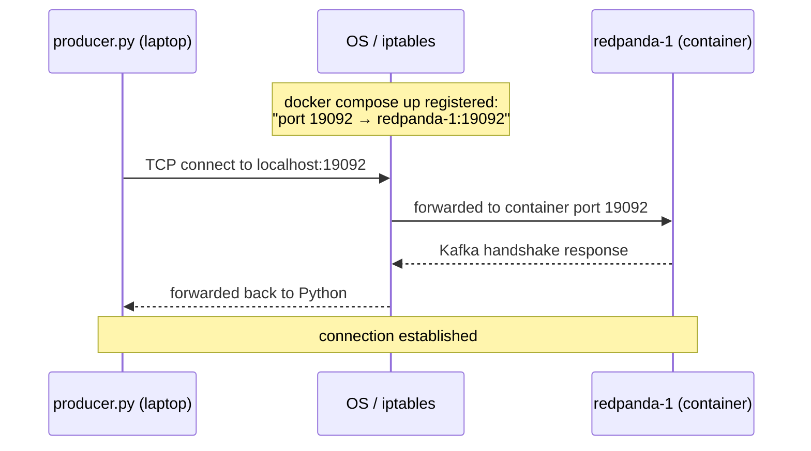
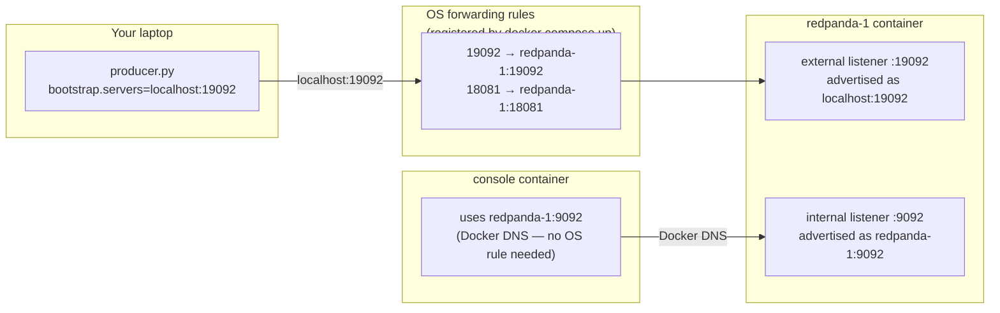
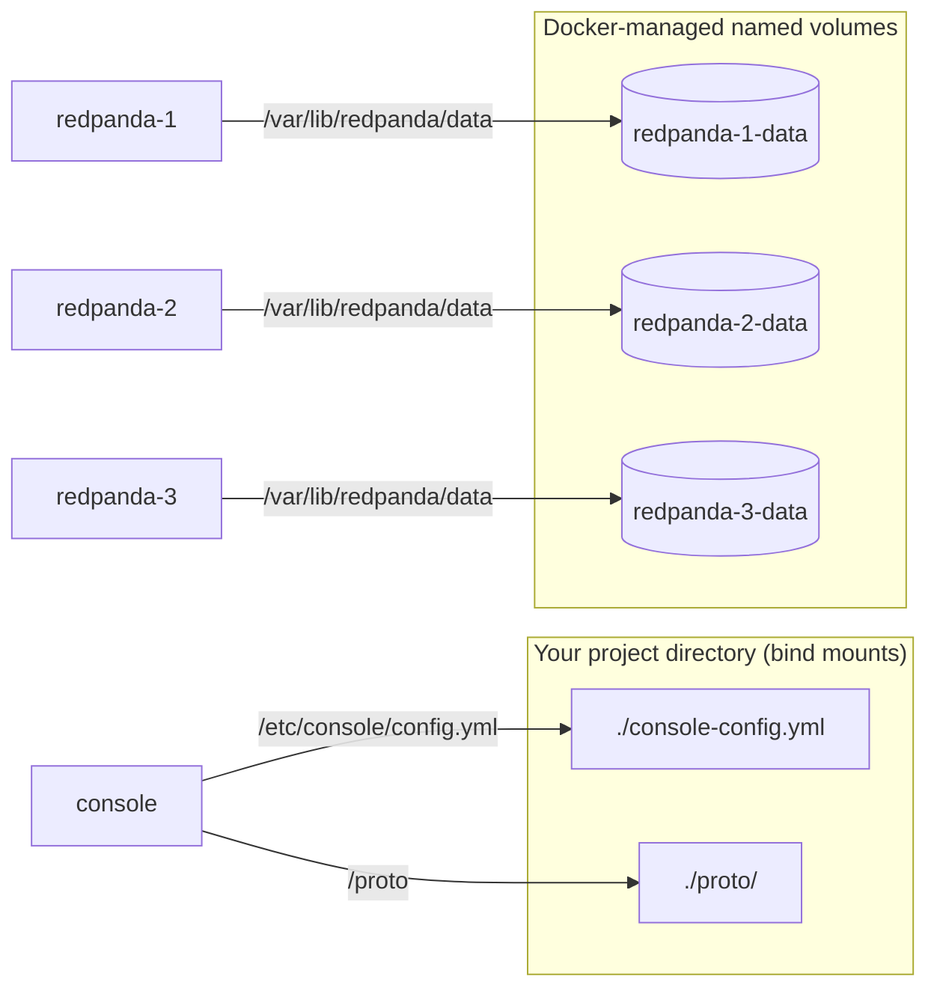
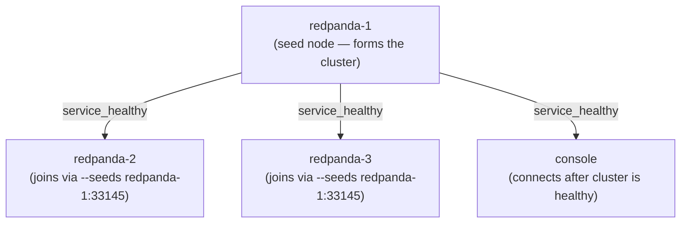

# Chapter — Docker Compose

> **You are here:** [Index](../README.md) → [Infra](./) → **Docker Compose**

---

## What it is

Docker Compose is a tool for defining and running multiple containers from a single YAML file. Instead of typing long `docker run` commands for every service, you describe the entire system declaratively and start it with one command.

```bash
docker compose up -d     # start everything in the background
docker compose down      # stop and remove containers
docker compose ps        # see what's running
docker compose logs -f   # tail all logs
```

The file (`docker-compose.yml`) has four top-level keys:

```yaml
version: "3.8"    # compose file format version

services:         # containers to run
  ...

volumes:          # named storage that persists across restarts
  ...

networks:         # virtual networks (optional — compose creates one by default)
  ...
```

---

## How a message travels from Python to Redpanda

This is the most important thing to understand about the networking. Let's follow a single `producer.py` call all the way into the broker, step by step.

---

### Step 0 — `docker compose up` registers forwarding rules with the OS

Before Python even runs, something happens when you start the cluster.

When Compose reads this in `docker-compose.yml`:

```yaml
ports:
  - "19092:19092"
```

It tells your **operating system** to register a forwarding rule: "any TCP connection arriving at port `19092` on this machine — redirect it into the `redpanda-1` container at port `19092`."

On Linux this is done via `iptables` (a kernel-level packet filter). On Mac and Windows it's equivalent rules inside Docker Desktop's networking layer. Either way, it's the **OS**, not Python and not Redpanda, that intercepts the connection and hands it to Docker.

From your laptop's perspective, port `19092` now looks like any other server running locally. No special configuration needed in Python.

You can verify what rules Docker registered:

```bash
docker port redpanda-1
# 19092/tcp -> 0.0.0.0:19092
# 18081/tcp -> 0.0.0.0:18081
# 18082/tcp -> 0.0.0.0:18082
```

If a port is not listed in `ports:` in the compose file, no rule is registered — it's completely unreachable from your laptop, as if it doesn't exist.

---

### Step 1 — Python connects to `localhost:19092`

Your script runs on your laptop, outside Docker. It tells the Kafka client which broker to reach:

```python
'bootstrap.servers': 'localhost:19092'
```

`localhost` means "this machine." Port `19092` is the host port you mapped. Python reaches out to `localhost:19092` — it has no idea Docker is involved.

---

### Step 2 — The OS forwards the connection into the container

The forwarding rule registered in Step 0 kicks in. The OS intercepts the TCP connection to port `19092` and redirects it into the `redpanda-1` container at port `19092`.



---

### Step 3 — Redpanda answers on its "external" listener

Inside the container, Redpanda is configured to listen on two ports for the Kafka protocol:

```
--kafka-addr internal://0.0.0.0:9092,external://0.0.0.0:19092
```

- Port **`9092`** — the "internal" listener. Only other Docker containers use this. It's not mapped to the host so your laptop can't reach it.
- Port **`19092`** — the "external" listener. This is what receives your forwarded connection from the host.

Your connection, forwarded by the OS, arrives at port `19092` inside the container. Redpanda picks it up on the external listener.

---

### Step 4 — Redpanda tells Python its address for future connections

Kafka's bootstrap process works in two rounds:

1. The client connects once to get the full broker list.
2. The client reconnects to the actual broker to produce/consume.

In step 2, the broker needs to tell the client what address to reconnect to. Redpanda uses the `--advertise-kafka-addr` setting for this:

```
--advertise-kafka-addr external://localhost:19092
```

So Python is told: "reconnect to `localhost:19092`." That goes through the same OS forwarding rule again — same path, every time.

If this advertised address were wrong (e.g. `redpanda-1:19092`, a hostname your laptop can't resolve), Python would connect on the first hop and fail silently on the second. This is the most common networking mistake with Kafka in Docker.

---

### The full journey



The Console is a Docker container too, so it bypasses the OS rules entirely — it reaches Redpanda directly using Docker's built-in DNS (`redpanda-1:9092`). It uses the internal listener. Your Python script is on the host, so it goes through the OS forwarding rules every time.

---

### Why two listeners?

You might ask: why not just use one port and map it?

The problem is what Redpanda **advertises back** to each caller. Each listener advertises a different address:

- External listener advertises `localhost:19092` → correct for your Python script on the host
- Internal listener advertises `redpanda-1:9092` → correct for Docker containers using Docker DNS

If there were only one listener and it advertised `localhost:19092`, the Console (running inside Docker) would be told to reconnect to `localhost:19092` — which inside a container means *the container itself*, not Redpanda. It would immediately fail.

Two listeners means each caller gets back an address that actually works for them.

---

## Ports — quick reference

### The format

```yaml
ports:
  - "HOST_PORT:CONTAINER_PORT"
```

`HOST_PORT` is what you connect to on your laptop. `CONTAINER_PORT` is what the process inside the container is listening on. Docker registers an OS forwarding rule between them when `compose up` runs.

### All mapped ports in ShipStream

| Host port | Container port | Service | Used by |
|-----------|---------------|---------|---------|
| `19092` | `19092` | redpanda-1 | Python scripts, `rpk` CLI |
| `18081` | `18081` | redpanda-1 | Python scripts (Schema Registry) |
| `18082` | `18082` | redpanda-1 | REST clients (Pandaproxy) |
| `29092` | `29092` | redpanda-2 | Direct node 2 access |
| `28081` | `28081` | redpanda-2 | Direct node 2 Schema Registry |
| `28082` | `28082` | redpanda-2 | Direct node 2 Pandaproxy |
| `39092` | `39092` | redpanda-3 | Direct node 3 access |
| `38081` | `38081` | redpanda-3 | Direct node 3 Schema Registry |
| `38082` | `38082` | redpanda-3 | Direct node 3 Pandaproxy |
| `8080` | `8080` | console | Browser |

### Ports that are NOT mapped to the host

The inter-broker RPC port (`33145`) has no `ports:` entry. Redpanda nodes use it to replicate data and elect leaders, but only from inside Docker — container to container via Docker DNS. Your laptop never needs to reach it, so no OS forwarding rule is registered for it.

```yaml
# Appears in the command flags but NOT in ports:
- --rpc-addr redpanda-1:33145
- --advertise-rpc-addr redpanda-1:33145

# redpanda-2 joins by reaching the seed node via Docker DNS:
- --seeds redpanda-1:33145
```

---

## Volumes — in depth

### The problem volumes solve

When you delete a Docker container, everything written inside its filesystem disappears. If Redpanda stored messages directly inside the container, `docker compose down` would wipe all your data. Volumes are storage that exists independently of containers — they survive container deletion.

### Two types: named volumes and bind mounts

**Named volume** — Docker manages it:

```yaml
volumes:
  - redpanda-1-data:/var/lib/redpanda/data
```

Think of it as Docker creating a dedicated storage area for this container and mounting it at that path. All Kafka log segments (your messages), topic metadata, and consumer offsets land here. Docker decides the actual location on your machine (usually under `/var/lib/docker/volumes/`). The data survives even if you delete and recreate the container.

**Bind mount** — you point at a specific file or folder on your machine:

```yaml
volumes:
  - ./console-config.yml:/etc/console/config.yml
  - ./proto:/proto
```

The `./` path is relative to your project directory. The file is shared directly — no copying involved. If you edit `console-config.yml` on your laptop, the container sees the change immediately without a restart.

### Named volume vs bind mount

| | Named volume | Bind mount |
|---|---|---|
| **Who controls the location** | Docker | You |
| **Survives `docker compose down`** | Yes | N/A — it's your file |
| **Destroyed by `docker compose down -v`** | Yes | No — your files are never touched |
| **Best for** | Broker/database data | Config files, source code |

### ShipStream volume layout



Each broker gets its own named volume because each broker owns a distinct set of partition replicas. Sharing a volume would cause brokers to overwrite each other's log files.

The console gets two bind mounts:
- `console-config.yml` — tells it where the brokers and Schema Registry are
- `proto/` — your `.proto` files so the web UI can decode Protobuf messages in-browser

### Named volumes must also appear in the top-level `volumes:` block

Named volumes need to be declared at the top level, even if the declaration is empty:

```yaml
volumes:
  redpanda-1-data:
  redpanda-2-data:
  redpanda-3-data:
```

This tells Compose to create these volumes if they don't exist yet. Without it, Compose errors on startup even if the volume is referenced in a service.

### Wiping everything to start fresh

```bash
# Stop containers, keep all message data
docker compose down

# Stop containers AND delete all named volume data (full reset)
docker compose down -v
```

`-v` removes the named volumes — all stored messages are gone. Your bind-mounted files (`console-config.yml`, `proto/`) are never touched.

---

## `depends_on` and healthchecks

`depends_on` with `condition: service_healthy` makes Compose wait until a service passes its healthcheck before starting the dependent service.

```yaml
depends_on:
  redpanda-1:
    condition: service_healthy
```

A healthcheck is a command Compose runs inside the container on a timer:

```yaml
healthcheck:
  test: ["CMD-SHELL", "rpk cluster health | grep -E 'Healthy:.+true' || exit 1"]
  interval: 5s      # run every 5 seconds
  timeout: 10s      # fail if it takes longer than 10s
  retries: 10       # declare unhealthy after 10 consecutive failures
```

Without this, Compose would start the console before Redpanda is ready and it would fail to connect.

---

## Startup order



`redpanda-1` starts first and forms the cluster. Once its healthcheck passes, `redpanda-2`, `redpanda-3`, and the console all start in parallel.

---

## Common commands

```bash
# Start all services (detached)
docker compose up -d

# Follow all logs
docker compose logs -f

# Follow one service's logs
docker compose logs -f redpanda-1

# See container status and health
docker compose ps

# Stop, keep data
docker compose down

# Stop and wipe all data (full reset)
docker compose down -v

# Restart one service
docker compose restart redpanda-1

# Run a command inside a running container
docker compose exec redpanda-1 rpk cluster health
```

---

> ← [Previous: Redpanda Console](./redpanda-console.md) | [Index](../README.md) | [Next: Python Packages →](./python-packages.md)
