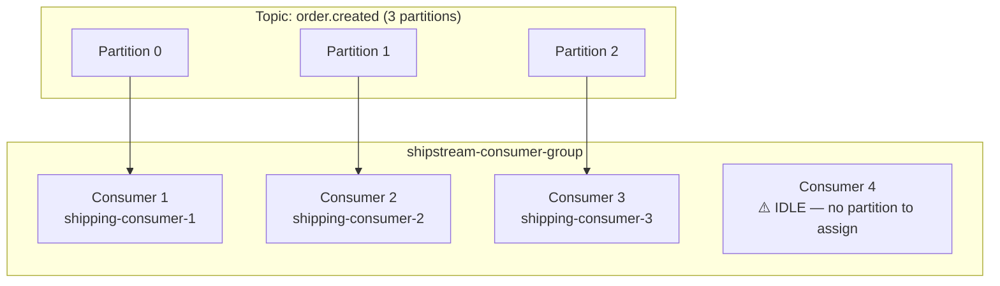

# Chapter 4 — Consumer Groups

> **You are here:** [Index](../README.md) → [Offsets](./offsets.md) → **Consumer Groups**

---

## What is a consumer group?

A **consumer group** is a named set of consumer instances that cooperate to read a topic. Kafka distributes partitions across the members so that:

- Every partition is owned by exactly **one** consumer in the group
- Every message is processed by exactly **one** consumer in the group
- If a consumer dies, its partitions are reassigned to the survivors

The group is identified by a string `group.id`. Kafka tracks the group's offset per partition server-side.

---

## One consumer per partition — the fundamental rule

This is non-negotiable in Kafka. Within a consumer group, a partition can only be assigned to one consumer at a time.



**Why?** Ordering. If two consumers could read the same partition simultaneously, there's no way to guarantee they process messages in sequence. One consumer per partition = strict ordering within that partition.

---

## Scaling with consumer groups

To handle more throughput, add consumers up to the partition count. Beyond that, create more partitions (at topic creation time).

| Partitions | Max useful consumers | Pattern |
|-----------|---------------------|---------|
| 1 | 1 | Development / low traffic |
| 3 | 3 | Small production |
| 12 | 12 | Medium production |
| 100 | 100 | High-throughput (Uber, Netflix scale) |

**Industry examples:**

| Industry | Group name | Consumers | Why that many |
|----------|-----------|-----------|--------------|
| **Payments** | `fraud-detection-group` | 50 | Each payment must be checked in <100ms; needs massive parallelism |
| **Logistics** | `warehouse-assignment-group` | 10 | Each order needs a warehouse lookup; moderate latency ok |
| **Streaming** | `recommendation-group` | 200 | Billions of play events per day; needs extreme parallelism |
| **Retail** | `inventory-sync-group` | 5 | Inventory updates are infrequent; light load |

---

## Multiple groups = independent reads

Different services that need the same events use different `group.id` values. They each get their own independent offset pointer on every partition.

```
Topic: order.created
         │
         ├──────────────────────────────────────────────
         │                                              │
inventory-consumer-group                  analytics-consumer-group
  partition-0 → offset 200                  partition-0 → offset 50
  partition-1 → offset 195                  partition-1 → offset 48
  partition-2 → offset 198                  partition-2 → offset 51
  (fully caught up)                         (batch processing, behind by design)
```

Publishing one order event → both groups eventually process it. Neither group knows the other exists.

**Real-world example — Uber:**
A single `driver.location.updated` topic is consumed by:
- `routing-group` — updates the driver's position for dispatch decisions
- `eta-group` — recalculates arrival times for riders
- `surge-pricing-group` — tracks supply density per zone
- `analytics-group` — feeds the data warehouse

Four completely independent services, one topic, four group offsets.

---

## group.id and client.id

```python
consumer = Consumer({
    "bootstrap.servers": BROKER,
    "group.id": "shipstream-consumer-group",           # which group this instance belongs to
    "client.id": f"shipstream-consumer-{CONSUMER_ID}", # identifies THIS instance in the UI
    "auto.offset.reset": "earliest",
})
```

`group.id` — determines offset tracking and partition assignment.

`client.id` — purely for visibility. Without it, every consumer shows as `rdkafka` in the Redpanda Console, making it impossible to see which instance owns which partition.

`auto.offset.reset` — what to do when the group has no committed offset yet:
- `"earliest"` — read from the very beginning of the log
- `"latest"` — skip all existing messages, only read new ones

---

> ← [Previous: Offsets](./offsets.md) | [Index](../README.md) | [Next: Producer →](./producer.md)
