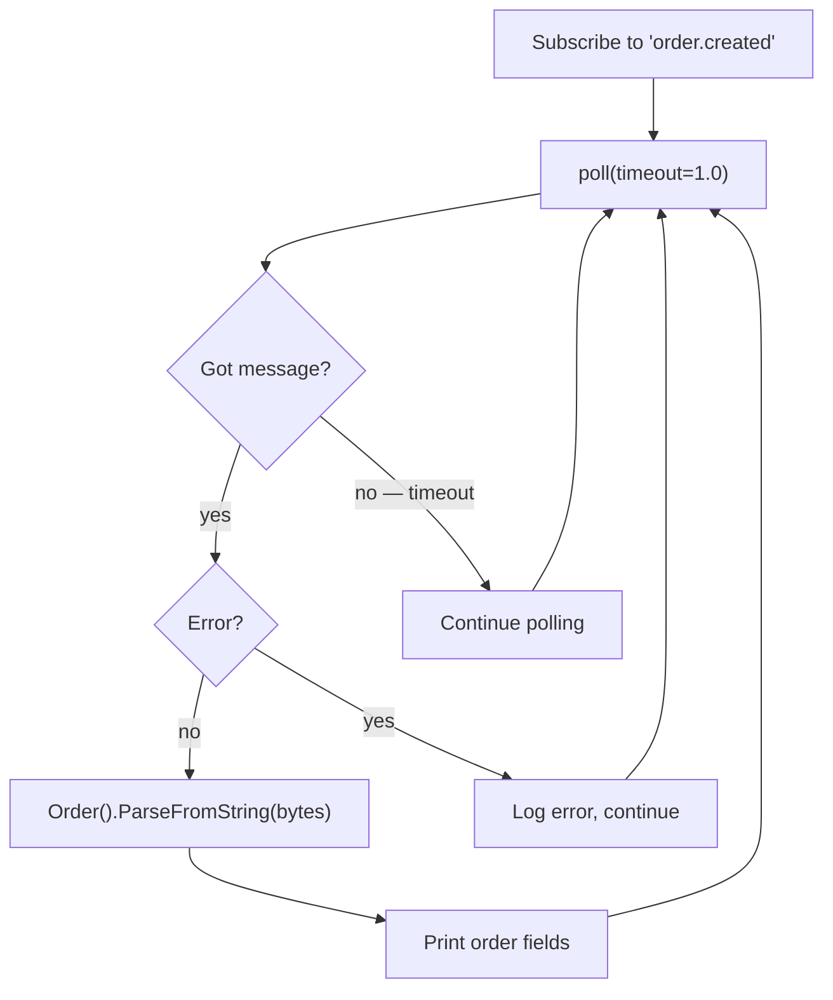

# Chapter 6 — Consumer

> **You are here:** [Index](../README.md) → [Producer](./producer.md) → **Consumer**

---

## What a consumer does

A consumer is a **long-running process** that polls Kafka for new messages, deserializes them, and processes them. Unlike a producer which fires and exits, a consumer runs forever — waiting, reading, processing, repeating.

---

## The poll loop

```python
while True:
    msg = consumer.poll(timeout=1.0)

    if msg is None:
        continue              # nothing arrived within 1 second, loop again
    if msg.error():
        handle_error(msg)
        continue

    order = Order()
    order.ParseFromString(msg.value())
    process(order)
```

`poll(timeout=1.0)` does two things:
1. Waits up to 1 second for a new message
2. In the background: sends heartbeats to the broker, handles rebalances, commits offsets

The timeout is not wasted time — Kafka uses that window for coordination. Never replace the poll loop with a sleep loop.

---

## ShipStream consumer flow



---

## Offset commits

After processing a message, the consumer needs to tell Kafka "I'm done with this one." This is called **committing the offset**.

By default, `confluent-kafka` auto-commits offsets every 5 seconds in the background. You can also commit manually for more control:

```python
consumer.commit(msg)   # commit after processing this specific message
```

**Why this matters:**

```
Message at offset 42 arrives
Consumer starts processing...
  [auto-commit fires at 5s → offset 42 committed]
  ...consumer crashes mid-processing...
Consumer restarts
→ Resumes from offset 43 (message 42 is LOST — committed before finished)

vs.

Message at offset 42 arrives
Consumer starts processing...
  ...consumer crashes mid-processing...
Consumer restarts
→ Resumes from offset 42 (message 42 is reprocessed — at-least-once)
```

**Industry approaches:**

| Industry | Approach | Why |
|----------|---------|-----|
| **Payments** | Manual commit after DB write | Never lose a payment event |
| **Analytics** | Auto-commit | Losing an occasional analytics event is acceptable |
| **Inventory** | Manual commit after inventory updated | Double-processing an order is worse than reprocessing |
| **Email** | Idempotency check + auto-commit | Emails can be deduplicated by message ID |

---

## CONSUMER_ID env var

When running multiple instances, each one reads `CONSUMER_ID` from the environment to tag its log lines:

```bash
CONSUMER_ID=2 python3 services/consumer.py
```

```python
CONSUMER_ID = os.environ.get("CONSUMER_ID", "1")
TAG = f"[Consumer-{CONSUMER_ID}]"
```

Output:
```
[Consumer-2] partition=1 offset=42 | id=a3f1bc... customer=customer-17 item='Webcam' amount=$89.99
```

This also sets the `client.id` in Kafka so the Redpanda Console can show which physical instance owns which partition.

---

## Heartbeats and session timeouts

Kafka knows a consumer is alive because it sends **heartbeats** during `poll()`. If a consumer stops polling (e.g., gets stuck processing a slow message), Kafka declares it dead after `session.timeout.ms` (default 45 seconds) and triggers a rebalance to hand its partitions to another consumer.

This is why your processing logic inside the poll loop should be fast. For slow operations (database writes, external API calls), consider committing the offset after the slow work, or processing asynchronously.

---

## Graceful shutdown

```python
try:
    while True:
        msg = consumer.poll(timeout=1.0)
        ...
except KeyboardInterrupt:
    print("Shutting down.")
finally:
    consumer.close()    # ← commits pending offsets and leaves the group cleanly
```

`consumer.close()` is important — it commits any uncommitted offsets and sends a `LeaveGroup` request so Kafka can immediately rebalance without waiting for the session timeout.

---

> ← [Previous: Producer](./producer.md) | [Index](../README.md) | [Next: poll() and flush() →](./poll-and-flush.md)
