# Log Retention & Storage Configuration

Kafka doesn't delete individual messages. It deletes **segments** — chunks of the log that have been closed and aged out. Understanding that distinction is the key to understanding every retention setting in this chapter.

The examples use a **payment events** pipeline (`payment.initiated`, `payment.captured`, `payment.failed`) to keep the tradeoffs concrete.

---

## What lives on disk

Before retention settings make sense, you need to know what Kafka actually stores.

Kafka stores the **real message bytes** — not pointers, not references to object storage. The key, value, headers, timestamp, and offset for every message are written directly into segment files on disk. There is no indirection.

```
/var/kafka/data/payment.initiated-0/
  00000000000000000000.log        ← actual message bytes, offsets 0–3999
  00000000000000000000.index      ← sparse offset → byte-position index
  00000000000000000000.timeindex  ← sparse timestamp → offset index
  00000000000004000000.log        ← actual message bytes, offsets 4000–7999
  00000000000004000000.index
  00000000000004000000.timeindex
  00000000000008000000.log        ← active segment: where new writes land
  00000000000008000000.index
  00000000000008000000.timeindex
```

The `.log` file is where the payload lives. The `.index` and `.timeindex` files are compact lookup structures so the broker can seek to a specific offset or timestamp without scanning the entire `.log`. They index *into* the `.log` — they are not a substitute for it.

**Why this matters for sizing.** Because Kafka owns the bytes directly, `log.retention.bytes` and `log.segment.bytes` describe real disk consumption. A 10 MB message takes 10 MB of disk. A topic receiving 50,000 events/second at 200 bytes each consumes ~10 MB/s per partition — that's 36 GB/hour per partition if unchecked. Retention settings are your only defence against unbounded disk growth.

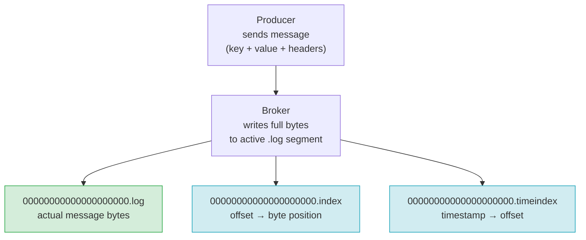

---

## Segments: the unit everything else is built on

Every partition has exactly **one active segment** (where appends go) and zero or more **closed segments** (sealed, read-only). The broker can only delete closed segments. The active segment is always kept, regardless of how old or large it is.

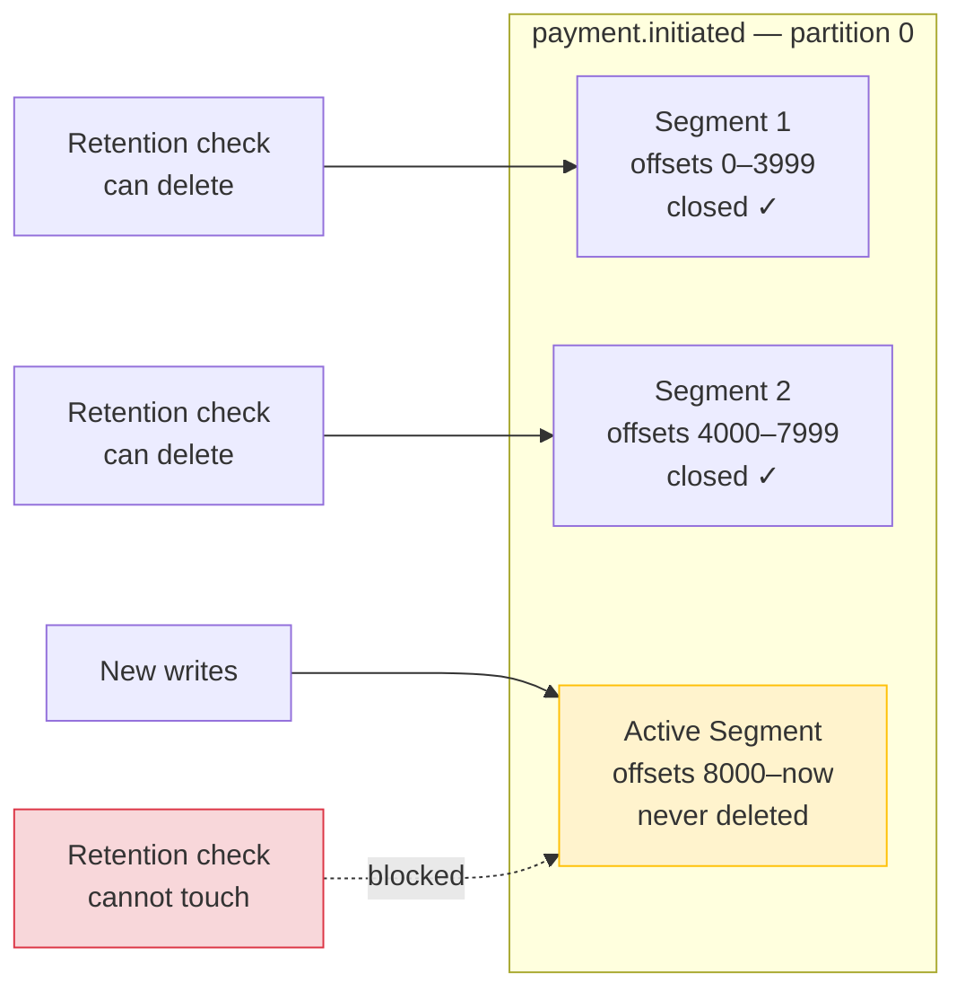

This is the most important invariant in Kafka retention: **you cannot delete a message independently of its segment**. If a single message in a closed segment is still within the retention window, the entire segment is kept.

---

## log.segment.bytes

```properties
log.segment.bytes=1073741824   # 1 GiB (default)
```

When the active segment reaches this size in bytes, the broker **rolls** it — closes it and opens a new active segment. The closed segment is now eligible for retention checks.

**The silent retention trap.** Suppose you set `log.retention.ms=3600000` (1 hour) but leave `log.segment.bytes` at 1 GiB. If `payment.failed` receives only 5 MB/hour:

```
1 GiB ÷ 5 MB/hour = ~200 hours before the active segment rolls
```

For 200 hours, no messages on this partition are eligible for deletion — even though they're all past the 1-hour retention window. The active segment is holding them open.

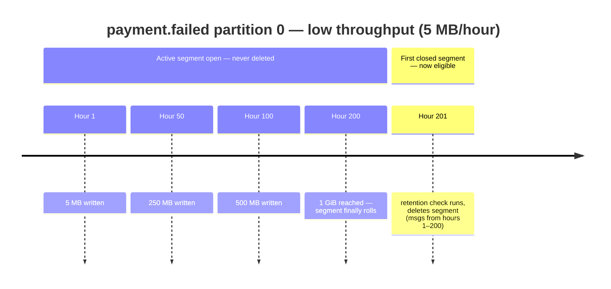

**Tuning for a payment pipeline.**

For `payment.initiated` at ~10 MB/s per partition, the default 1 GiB segment rolls every ~100 seconds. Fine.

For `payment.failed` at ~5 MB/hour, lower the segment size so it rolls more often:

```properties
log.segment.bytes=52428800   # 50 MiB — rolls every ~10 hours at 5 MB/h
```

---

## log.segment.ms

```properties
log.segment.ms=604800000   # 7 days (default)
```

A time-based roll trigger. Even if the active segment hasn't hit `log.segment.bytes`, the broker will roll it after this many milliseconds.

`log.segment.ms` and `log.segment.bytes` are **OR'd** — whichever fires first triggers the roll:

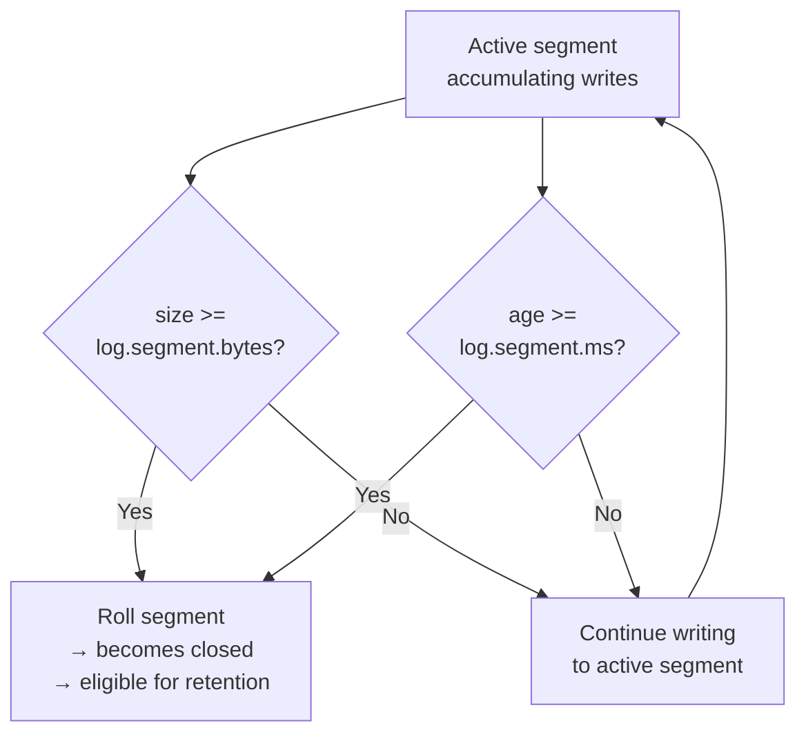

**Why you want both.** For high-throughput topics, `log.segment.bytes` keeps segments from growing without bound. For low-throughput topics, `log.segment.ms` prevents a segment from being held open for days just because it never filled up. Without a time-based roll, a quiet `payment.failed` topic might have its active segment open for weeks, trapping old messages and defeating your retention policy.

**Common configuration for a payments pipeline:**

```properties
log.segment.bytes=268435456   # 256 MiB
log.segment.ms=3600000        # 1 hour
```

On a busy day, the size limit fires. On a quiet day, the time limit fires. Either way, segments roll at most every hour.

---

## log.retention.ms

```properties
log.retention.ms=604800000   # 7 days (default)
```

The broker runs a background log cleaner thread that scans closed segments. A closed segment is deleted when the **timestamp of its last message** is older than `log.retention.ms`.

The key word is **last message**. A segment is retained as long as *any* message in it is newer than the threshold. A segment containing mostly 6-day-old messages but with one 5-minute-old message at the end will not be deleted.

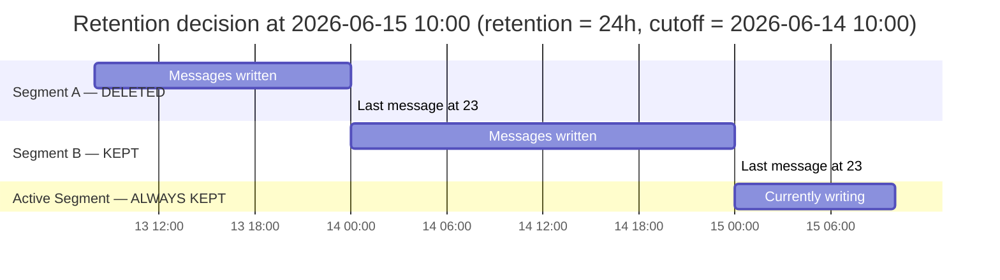

---

## log.retention.bytes

```properties
log.retention.bytes=-1   # unlimited (default)
```

A size-based retention cap, applied **per partition**. When the total size of closed segments in a partition exceeds this value, the broker deletes the oldest closed segments until the partition is back under the limit.

**This is a per-partition limit, not a per-topic limit.** A topic with 6 partitions and `log.retention.bytes=1073741824` (1 GiB) can hold up to 6 GiB total — 1 GiB per partition.

`log.retention.ms` and `log.retention.bytes` are **OR'd** — whichever triggers first wins:

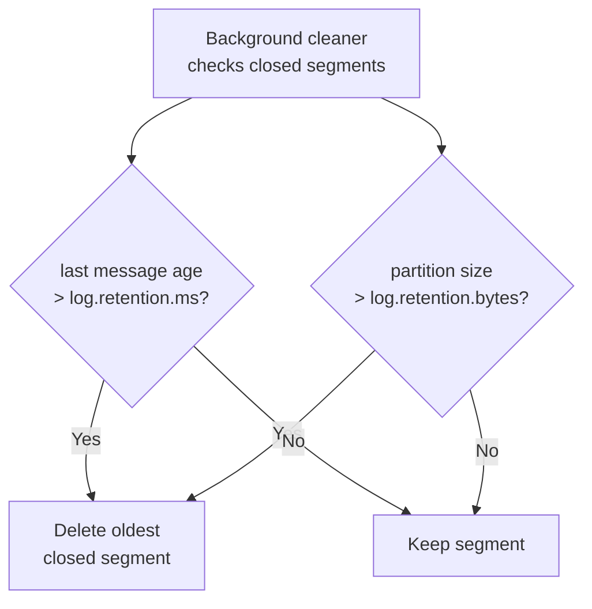

**Using both together.** A common production pattern:

```properties
log.retention.ms=86400000       # never keep data older than 24 hours
log.retention.bytes=5368709120  # never exceed 5 GiB per partition
```

On a normal day the time-based limit governs. If a produce spike fills 5 GiB before 24 hours elapse, the size-based limit kicks in first and prevents the disk from filling up. The size limit is your safety valve.

---

## message.max.bytes

```properties
message.max.bytes=1048576   # 1 MiB (default)
```

The maximum size of a single compressed message batch the broker will accept. If a producer sends a batch larger than this, the broker rejects it immediately with `MESSAGE_TOO_LARGE`.

**The three-way alignment problem.** Three places in the stack each have their own size limit, and all three must be consistent:

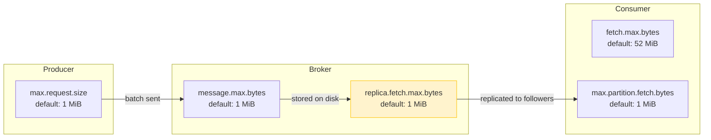

The highlighted `replica.fetch.max.bytes` is the most commonly forgotten setting. If you raise `message.max.bytes` on the broker but forget `replica.fetch.max.bytes`:

1. The leader broker accepts the large message (under `message.max.bytes`)
2. Follower brokers try to replicate it
3. The fetch response exceeds `replica.fetch.max.bytes` — followers can't replicate
4. The partition goes under-replicated and eventually stalls

**If you need larger messages, change all three layers:**

```properties
# broker
message.max.bytes=10485760
replica.fetch.max.bytes=10485760
```

```python
# producer
producer_config = {"max.request.size": 10485760}

# consumer
consumer_config = {
    "fetch.max.bytes": 10485760,
    "max.partition.fetch.bytes": 10485760
}
```

For payment pipelines, keep individual events small (< 1 KB) and put large payloads (documents, reconciliation files) in object storage with only a reference in the Kafka message. This avoids the alignment problem entirely.

---

## The log start offset and what happens when data is gone

Every Kafka partition tracks two key offsets:

- **Log end offset (LEO)** — the offset of the next message to be written (the tip of the log)
- **Log start offset** — the earliest offset that still exists on the broker

As segments are deleted by retention, the log start offset advances forward. Offsets below the log start offset no longer exist — the broker has no record of them.

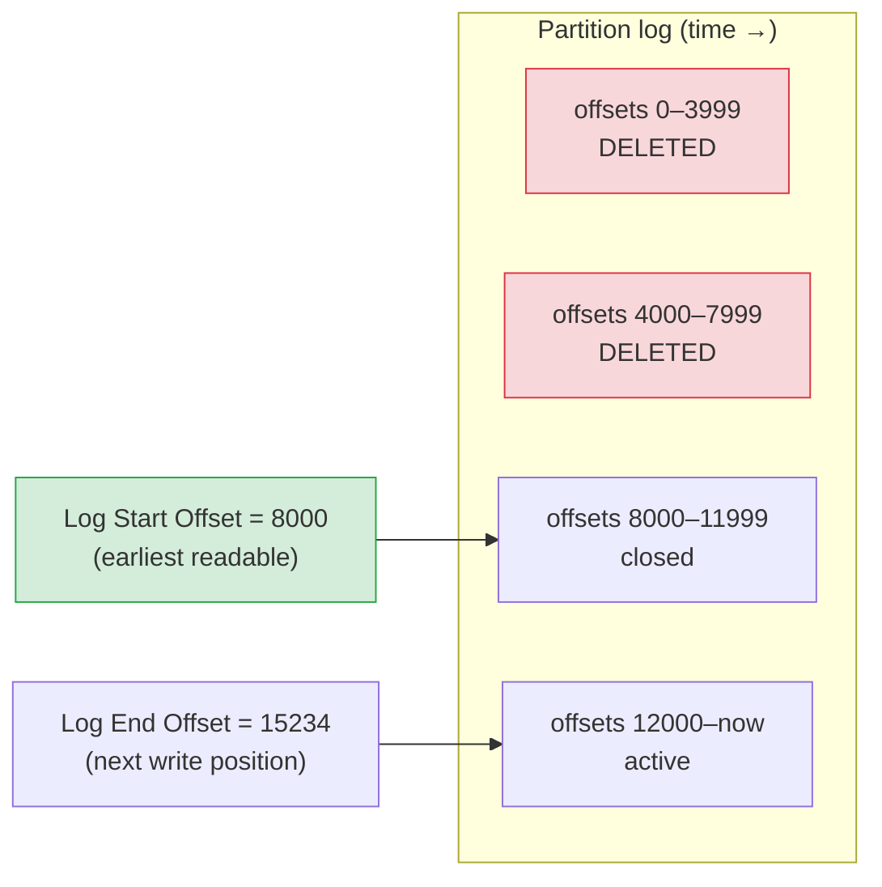

**What happens when a consumer tries to read a deleted offset.**

A consumer stores its committed offset (e.g., offset 3500) in the `__consumer_offsets` topic. If that offset falls below the log start offset, the consumer gets an `OFFSET_OUT_OF_RANGE` error on its next poll. Kafka does not serve data that has been deleted — it cannot reconstruct it.

The broker's `auto.offset.reset` setting controls what the consumer does next:

| `auto.offset.reset` | Behaviour |
|---|---|
| `earliest` | Silently resets to log start offset — skips all deleted messages without error |
| `latest` | Resets to log end offset — skips everything and starts from new messages only |
| `error` | Throws exception — the consumer halts, forces you to handle the gap explicitly |

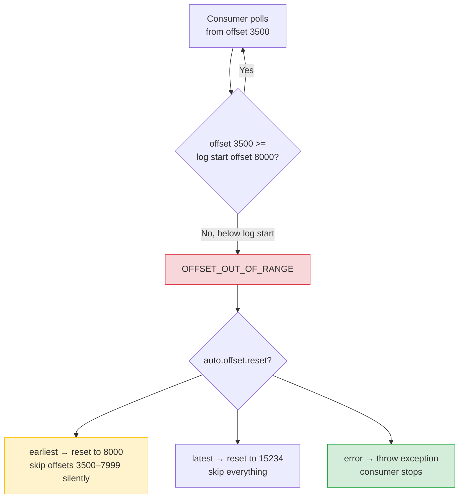

**`auto.offset.reset=error` is the safest default for production payment pipelines.** Silent resets mean silent data loss — the consumer moves on without processing the missed events, and you may never know. An exception forces you to decide: reprocess from S3 archive, replay from a snapshot, or consciously accept the gap.

---

## Tiered Storage: keeping old offsets readable after deletion

The log start offset problem has a clean solution: **tiered storage**. Instead of permanently deleting old segments, the broker offloads them to object storage (S3, GCS, Azure Blob) before removing them from local disk. The Kafka API still works transparently — consumers use the same `poll()` call, and the broker fetches old segments from object storage on demand.

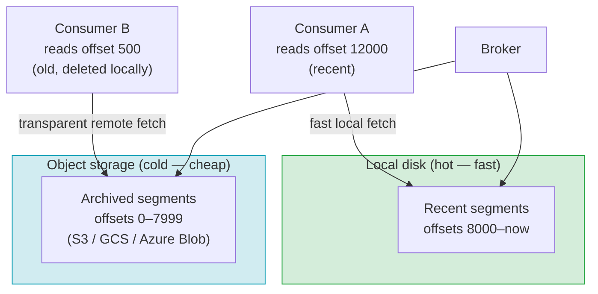

**From the consumer's perspective, nothing changes.** It still calls `consumer.seek(partition, offset=500)` and gets the message back. The broker handles the fetch from S3 transparently.

**Redpanda supports tiered storage natively.** In `docker-compose.yml`, you can enable it with:

```yaml
- --cloud-storage-enabled=true
- --cloud-storage-region=us-east-1
- --cloud-storage-bucket=my-redpanda-bucket
```

Once enabled, Redpanda uploads closed segments to S3 as they roll, and the local retention policy only governs how long segments stay on local disk — not how long they're readable. You can set local retention to 6 hours (cheap disk) and remote retention to 7 years (cheap S3) and consumers see a continuous log across both.

**Without tiered storage**, the only way to recover archived data is to build a separate read path: a consumer that read from Kafka and wrote to S3 (an archival consumer), and a separate restore process that reads from S3 and re-produces into Kafka (or queries S3 directly). This works but it means the original offsets are gone — you can't resume from offset 500, you have to re-produce the data at new offsets.

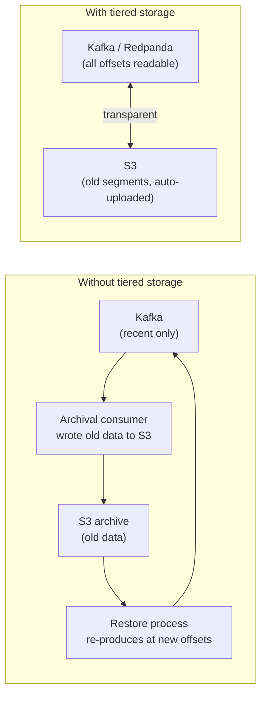

---

## The full picture

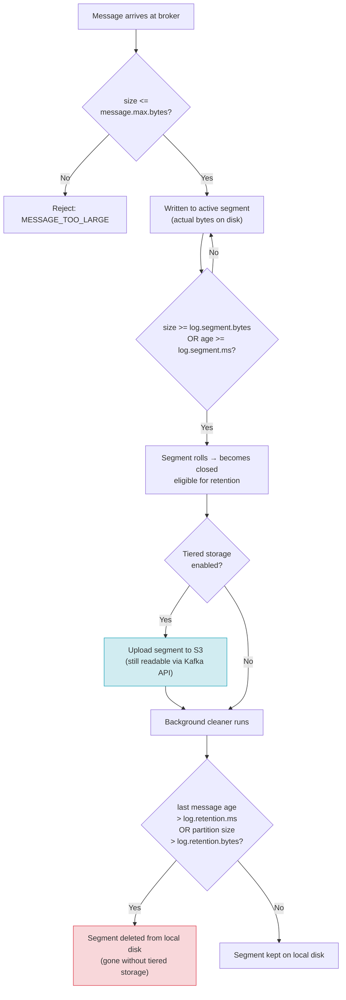

---

## cleanup.policy

```properties
cleanup.policy=delete   # default
```

Controls what the log cleaner does with old data. There are two policies, and they can be combined.

### delete

The default. The cleaner removes entire closed segments when they exceed `log.retention.ms` or `log.retention.bytes`. Old messages are permanently gone — consumers that fall behind far enough will hit `OFFSET_OUT_OF_RANGE`.

Use this for event streams where you care about recency, not the full history of every key: `order.created`, `payment.initiated`, audit logs.

### compact

Instead of deleting by age or size, the cleaner scans the log and removes any message whose key has a **newer message later in the log**. Only the latest value per key is kept, and it is kept forever.

```
Before compaction:
  offset 0 — key="user-1"  value="alice@old.com"   ← superseded
  offset 1 — key="user-2"  value="bob@example.com" ← latest for user-2
  offset 2 — key="user-1"  value="alice@new.com"   ← latest for user-1

After compaction:
  offset 1 — key="user-2"  value="bob@example.com"
  offset 2 — key="user-1"  value="alice@new.com"
```

The latest value per key is **never deleted** — no matter how old it is. This makes `compact` suitable for topics that represent current state: database changelogs, Kafka Streams state stores, config/feature flag topics.

To delete a key entirely from a compacted topic, produce a **tombstone** — a message with that key and a `null` value. The compactor treats the tombstone as the latest entry, drops all older values for that key, and eventually removes the tombstone itself after `delete.retention.ms` (default 24 hours).

### compact,delete

Both policies run **concurrently** on the same log — not sequentially. The cleaner simultaneously:
- Removes superseded keys (compaction)
- Removes closed segments that exceed `retention.ms` or `retention.bytes` (deletion)

The critical difference from pure `compact`: **retention can delete the latest message for a key** if it is old enough.

```
offset 0 — key="user-1"  value="old"   written 8 days ago  ← deleted by compaction (superseded)
offset 1 — key="user-2"  value="bob"   written 8 days ago  ← deleted by retention (8d > 7d window)
offset 2 — key="user-1"  value="new"   written 1 hour ago  ← survives both checks (for now)
```

Offset 2 will survive until it crosses the `retention.ms` threshold. At that point, if no newer message for `user-1` has arrived, deletion wins and the key disappears from the log entirely.

`compact,delete` is useful when you want current-state semantics but also need a safety valve to evict stale keys that are never updated again — preventing unbounded log growth.

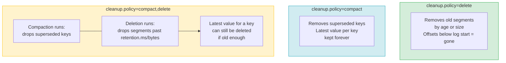

---

## Summary

| Setting | Default | What it controls |
|---|---|---|
| `cleanup.policy` | `delete` | How old data is removed: by age/size, by key supersession, or both |
| `log.segment.bytes` | 1 GiB | Maximum segment size before active segment rolls |
| `log.segment.ms` | 7 days | Maximum age before active segment rolls |
| `log.retention.ms` | 7 days | How long a closed segment is kept by last-message age |
| `log.retention.bytes` | unlimited | Max per-partition size before oldest segments are deleted |
| `message.max.bytes` | 1 MiB | Maximum batch size the broker accepts |

**The rules to burn in:**
1. Kafka stores **real bytes** on disk — not pointers. Size settings are real disk consumption.
2. Retention only deletes **closed segments** — the active segment is always kept.
3. `log.segment.bytes` and `log.segment.ms` are OR'd — either triggers a roll.
4. `log.retention.ms` and `log.retention.bytes` are OR'd — either triggers deletion.
5. Deleted offsets are **gone** — consumers hitting them get `OFFSET_OUT_OF_RANGE`. Use `auto.offset.reset=error` in production to catch this explicitly.
6. `message.max.bytes` must be aligned across producer → broker → consumer or replication silently breaks.
7. **Tiered storage** is the clean fix for long retention at low cost — local disk stays small, old offsets stay readable via S3.
8. `compact` keeps the latest value per key forever. `compact,delete` additionally ages out keys that go quiet past `retention.ms`.

---

## Next

[Phase 4 Simulation Guide — Log Retention in Action →](../simulations/phase4-guide.md)
