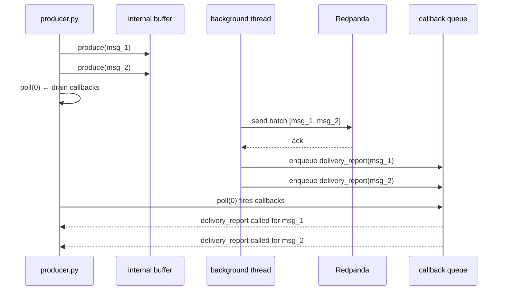
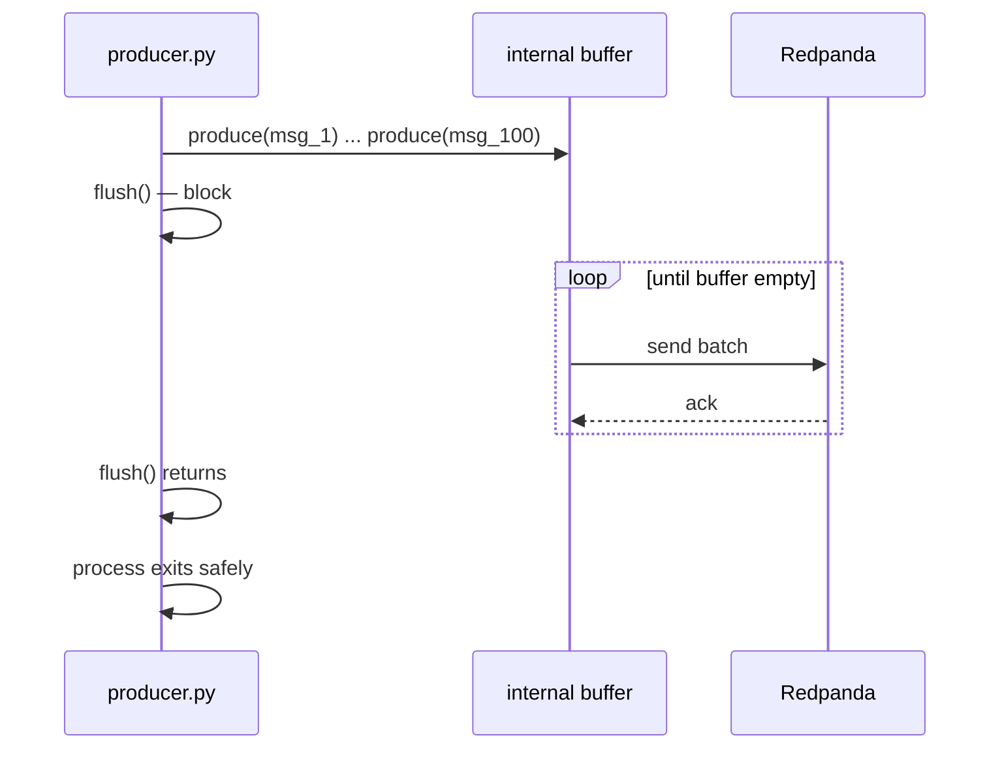
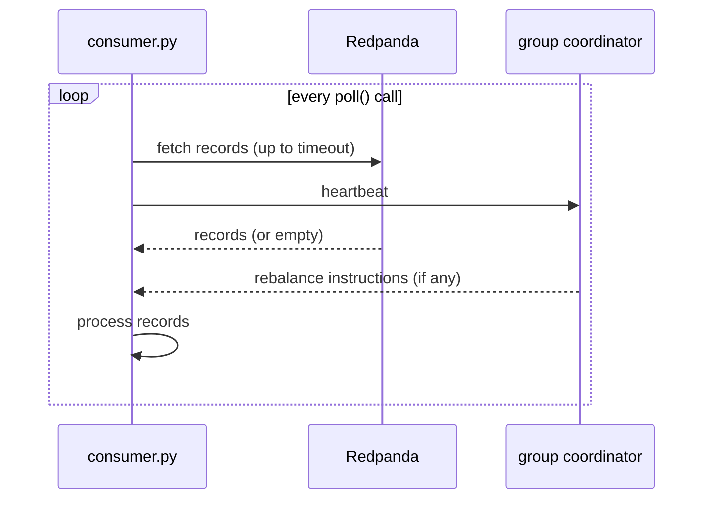

# Chapter 8 — poll() and flush()

> **You are here:** [Index](../README.md) → [Consumer](./consumer.md) → **poll() and flush()**

---

## The confusion

Both producers and consumers have a `poll()` method, but they do completely different things. And `flush()` only exists on the producer side. This chapter untangles all of it.

---

## The two queues inside the producer

Before getting into `poll()` and `flush()`, you need to know that the producer maintains **two completely separate queues**. Mixing them up is the source of most confusion.

```
┌──────────────────────────────────────────────────────────────┐
│  librdkafka internals (the C library under confluent-kafka)  │
│                                                              │
│  [message buffer]              [callback queue]              │
│  msg_1                         cb_for_msg_1   ← ready        │
│  msg_2                         cb_for_msg_2   ← ready        │
│  msg_3          →send→         cb_for_msg_3   ← ready        │
│  ...            ←ack←          ...                           │
│                                                              │
│  background thread             drained by your poll()        │
│  drains this one                                             │
└──────────────────────────────────────────────────────────────┘
```

**Message buffer** — filled by `produce()`, drained by a background thread that sends batches to the broker. Has a size limit (100,000 messages by default). If it fills up, `produce()` blocks your thread until there's room.

**Callback queue** — filled by the background thread *after* broker acks arrive, drained by your `poll()` calls. Has no size limit that affects `produce()`.

They move in sequence for each message:

```
message leaves buffer → broker acks → callback enters callback queue
```

But they are independent. The background thread manages both sides of that arrow. Your `poll()` only touches the right side.

---

### The pizza restaurant analogy

Think of it like a pizza restaurant:

- **You** (your thread) walk up and place orders: *"one margherita, one pepperoni"* — this is `produce()`. You hand the slip to the kitchen and walk away immediately. You are not standing there waiting.
- **The kitchen** (background thread) takes the slips, cooks the pizzas, sends them out for delivery, and waits for the delivery driver to confirm delivery.
- **The confirmation slips** (callback queue) pile up on a shelf near the register as deliveries are confirmed.
- **You checking the shelf** (calling `poll()`) is when you actually read those confirmations and act on them.

The key insight: the kitchen keeps cooking and delivering whether or not you check the shelf. `poll()` doesn't trigger delivery — it just reads the results of deliveries that already happened.

---

## Producer: how messages actually get sent

When you call `producer.produce(...)`, **the message is not sent immediately**. It goes into an internal in-memory buffer first. A background thread picks it up and batches it for network efficiency before sending to the broker.

```
producer.produce(...)
       ↓
  [internal buffer]
       ↓  (background thread)
  [broker receives batch]
       ↓
  [broker sends ack]
       ↓
  [delivery callback fires]
```

The delivery callback (your `delivery_report` function) is queued in a **callback queue** after the broker acknowledges the message. But that callback never fires unless *you* drain the queue by calling `poll()`.

---

## Producer: poll(0)

`producer.poll(timeout)` drains the delivery callback queue — it executes any callbacks that are waiting.

- `poll(0)` — non-blocking: process whatever callbacks are ready *right now*, then return immediately
- `poll(1.0)` — wait up to 1 second for a callback to arrive, then return

**Important:** `poll()` never talks to the broker. By the time you call `poll()`, the background thread has already sent the messages and received the acks. The callbacks are just sitting in the queue waiting for you to fire them. `poll()` is the trigger, not the network call.

```
background thread (always running, no poll() needed):
  msg_1 → broker → ack → callback for msg_1 enters queue
  msg_2 → broker → ack → callback for msg_2 enters queue
  msg_3 → broker → ack → callback for msg_3 enters queue

your thread:
  poll(0) → sees 3 callbacks ready → fires all 3 → queue empty
```

```python
for i in range(100):
    producer.produce(
        topic=TOPIC,
        key=order.id.encode(),
        value=order.SerializeToString(),
        callback=delivery_report,
    )
    if i % 10 == 0:
        producer.poll(0)   # drain callbacks without blocking the loop
```

Without `poll()`, the callback queue keeps growing. Eventually the buffer backs up and `produce()` starts blocking.



---

## Producer: flush()

`flush()` is a **blocking** drain. It waits until the buffer is empty AND every pending delivery callback has fired.

```python
producer.produce(...)   # × 100
producer.flush()        # ← block here until all 100 are acked
```

Internally, `flush()` is just `poll()` in a loop:

```
while buffer is not empty or callbacks are pending:
    poll(timeout)
```

**Always call `flush()` before your producer process exits.** If you skip it, buffered messages are silently dropped — the process exits before the background thread has a chance to send them.



---

## Consumer: poll(timeout)

On the consumer side, `poll()` is entirely different — it is the **main event loop driver**, not a callback drainer.

Every call to `consumer.poll(timeout)` does four things:

1. Waits up to `timeout` seconds for a new message from the broker
2. Returns that message (or `None` if the timeout expired)
3. Sends a **heartbeat** to the group coordinator
4. Handles any pending **rebalance** events (join group, sync group, revoke partitions)

```python
while True:
    msg = consumer.poll(timeout=1.0)

    if msg is None:
        continue        # timeout — no message, but heartbeat was sent
    if msg.error():
        continue

    process(msg)
```

The timeout is not idle time. Even when no messages arrive, `poll()` is doing coordination work in the background. **If you stop calling `poll()`, Kafka thinks your consumer is dead** and triggers a rebalance.



---

## What happens if you stop polling on the consumer

```
consumer.poll()   ← called
consumer.poll()   ← called
... consumer gets stuck on a slow DB write for 46 seconds ...
                  ← NO poll() called for 46 seconds
                  ← session.timeout.ms (default 45s) exceeded
                  ← group coordinator declares consumer dead
                  ← REBALANCE triggered
                  ← partitions reassigned to other consumers
consumer.poll()   ← called again — but now it's getting ERROR: rebalance
```

This is one of the most common production bugs. The fix is to either:
- Keep processing fast (< `max.poll.interval.ms`, default 5 minutes)
- Commit the offset and hand off slow work to a separate thread

---

## Side-by-side comparison

| | `producer.poll(timeout)` | `consumer.poll(timeout)` |
|---|---|---|
| **What it does** | Drains delivery callback queue | Fetches records + sends heartbeat + handles rebalance |
| **Blocks?** | Only up to `timeout` | Only up to `timeout` |
| **Side effects** | Fires delivery callbacks | Sends heartbeat, may trigger rebalance |
| **What happens if you skip it** | Callback queue fills → buffer backs up | Kafka declares consumer dead → rebalance |
| **Typical call** | `poll(0)` in the produce loop | `poll(1.0)` in the main while loop |

---

## flush() vs close()

| | `producer.flush()` | `consumer.close()` |
|---|---|---|
| **What it does** | Drains buffer + waits for all acks | Commits pending offsets + sends LeaveGroup |
| **When to call** | Before producer process exits | Before consumer process exits |
| **What happens if you skip it** | Buffered messages silently dropped | Broker waits for session timeout before rebalancing |

---

## Code example: producer with poll and flush

```python
from confluent_kafka import Producer

producer = Producer({"bootstrap.servers": "localhost:19092"})

def delivery_report(err, msg):
    if err:
        print(f"[ERROR] {err}")
    else:
        print(f"[OK] partition={msg.partition()} offset={msg.offset()}")

for i in range(100):
    producer.produce(
        topic="order.created",
        key=f"order-{i}".encode(),
        value=b"...",
        callback=delivery_report,
    )
    if i % 10 == 0:
        producer.poll(0)        # drain callbacks every 10 messages

producer.flush()                # block until all 100 are confirmed
print("All messages delivered.")
```

---

## Code example: consumer poll loop

```python
from confluent_kafka import Consumer

consumer = Consumer({
    "bootstrap.servers": "localhost:19092",
    "group.id": "shipstream-consumer-group",
    "auto.offset.reset": "earliest",
})
consumer.subscribe(["order.created"])

try:
    while True:
        msg = consumer.poll(timeout=1.0)    # fetch + heartbeat + rebalance

        if msg is None:
            continue        # timeout — no message this second
        if msg.error():
            print(f"[ERROR] {msg.error()}")
            continue

        print(f"offset={msg.offset()} value={msg.value()}")

except KeyboardInterrupt:
    pass
finally:
    consumer.close()        # commit offsets + leave group cleanly
```

---

## Summary

- **`producer.poll(0)`** — drain delivery callbacks without blocking. Call it periodically inside your produce loop so the callback queue never fills up.
- **`producer.flush()`** — block until every buffered message is confirmed. Always call this before the producer exits.
- **`consumer.poll(timeout)`** — the heartbeat of a consumer. Fetches messages AND keeps the consumer alive in the group. Never stop calling it.
- **`consumer.close()`** — clean shutdown: commits offsets and tells the broker you're leaving so it can rebalance immediately.

---

> ← [Previous: Consumer](./consumer.md) | [Index](../README.md) | [Next: Rebalancing →](./rebalancing.md)
