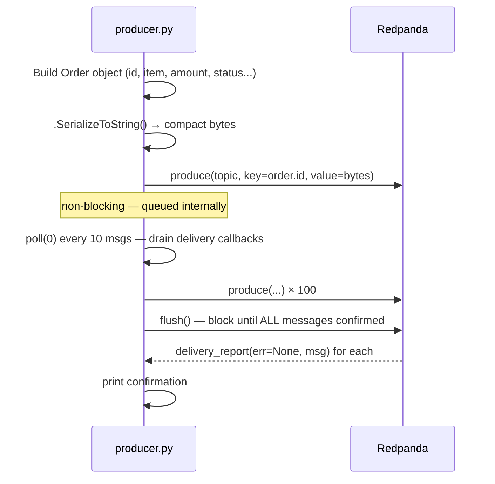

# Chapter 5 — Producer

> **You are here:** [Index](../README.md) → [Consumer Groups](./consumer-groups.md) → **Producer**

---

## What a producer does

A producer's job is simple: **take data, serialize it, send it to the right topic with the right key**.

The complexity is in the guarantees — making sure messages actually arrive, handling backpressure, and routing messages to the correct partition for ordering.

---

## ShipStream producer flow



---

## The partition key decision

```python
producer.produce(
    topic=TOPIC,
    key=order.id.encode(),        # ← this decides the partition
    value=order.SerializeToString(),
    callback=delivery_report,
)
```

Kafka hashes `order.id` → consistent partition assignment. All events for the same order always land on the same partition → consumer sees them in order.

**What happens without a key?** Kafka round-robins across partitions. Fine for independent events but breaks ordering for related events.

**Industry partition key examples:**

| Industry | Bad key choice | Good key choice | Why |
|----------|---------------|----------------|-----|
| Banking | None (round-robin) | `account_id` | Debit must be seen before overdraft check |
| Ride-sharing | `city` | `driver_id` | Location pings for one driver must be ordered |
| E-commerce | `product_id` | `order_id` | Order lifecycle events must be in sequence |
| IoT | None | `device_id` | Sensor readings must be in time order per device |
| Social | `timestamp` | `user_id` | A user's posts must appear in chronological order |

---

## Delivery guarantees

Kafka producers have three delivery modes:

| Mode | Config | Guarantee |
|------|--------|-----------|
| Fire-and-forget | No callback, no flush | Message may be lost |
| At-least-once | `callback` + `flush()` | Message delivered, possibly more than once on retry |
| Exactly-once | Idempotent producer + transactions | Delivered exactly once, most complex |

ShipStream uses **at-least-once**: the `delivery_report` callback confirms each message and `flush()` blocks until all are confirmed.

```python
def delivery_report(err, msg):
    if err:
        print(f"[ERROR] Delivery failed: {err}")
    else:
        print(f"[OK] partition={msg.partition()} offset={msg.offset()}")
```

---

## poll() inside the loop

```python
for i in range(COUNT):
    producer.produce(...)
    if i % 10 == 0:
        producer.poll(0)   # ← drain delivery callbacks without blocking
```

`produce()` is non-blocking — it queues messages in an internal buffer. If you never call `poll()`, the delivery callback queue fills up and the buffer backs up. Calling `poll(0)` every 10 messages keeps it drained without slowing the loop.

`flush()` at the end is a blocking `poll()` that waits until every queued message has been acknowledged.

---

## What the output tells you

```
[OK] partition=2 offset=37
[OK] partition=0 offset=12
[OK] partition=1 offset=9
```

The offsets are not sequential across partitions — each partition has its own counter. The partition is determined by hashing `order.id`. You have no control over which partition a message goes to (by design — the hash is deterministic given the key).

---

## acks — when does replication happen?

The `acks` setting controls whether the broker waits for replication before confirming a write to the producer.

```
acks=0   Producer fires and forgets. No ACK waited for. Highest throughput, no durability.

acks=1   Leader writes to page cache → ACK sent → followers replicate asynchronously.
         If the leader crashes after the ACK but before replication, the message is gone.
         The producer already discarded it from its buffer (it got a success).

acks=all Leader writes → waits for all ISR members to fetch and confirm → ACK sent.
         By the time the producer gets success, every ISR broker has a copy.
         A leader crash cannot cause data loss.
```

**Silent data loss with `acks=1`**

With `acks=1`, the producer sees a successful ACK and discards the message from its internal buffer. If the leader crashes in the window between ACK and replication, the message is gone — the new leader never had it, and the producer won't retry because as far as it knows the write succeeded.

```
Producer          Leader (Broker 1)      Follower (Broker 2)
   │──── produce ────▶│                        │
   │◀──── ACK ────────│                        │
   │                  │  💥 crash              │
   │  (message gone,  ✗               elected as leader
   │   producer won't │
   │   retry)                                  │
```

With `acks=all` this window doesn't exist — the ACK only arrives after the follower already has the data.

**Latency cost of `acks=all`**

The leader has to wait for follower fetch-and-confirm round trips before responding. In a 3-broker cluster with 2 followers in the ISR, the slowest follower sets your write latency. That's the direct tradeoff — durability costs the time it takes for the slowest replica to catch up.

---

## flush() — batch semantics

`flush()` blocks until all messages currently in the internal buffer have been acknowledged. It doesn't care how many messages that is — it waits for all of them.

```python
producer.produce(...)  # message 1 → buffer
producer.produce(...)  # message 2 → buffer
producer.produce(...)  # message 3 → buffer
producer.flush()       # blocks until ACKs for 1, 2, AND 3 are received
```

**`flush()` does not force a single batch.** The producer's I/O thread runs independently of your application code. It sends whenever `linger.ms` expires or `batch.size` fills up — it doesn't wait for `flush()`. So if your loop takes 50ms and `linger.ms=5`, the I/O thread may have already sent several batches by the time `flush()` is called. `flush()` just blocks until whatever is still in-flight lands.

```python
# Maximum durability, terrible throughput — one round trip per message
for order in orders:
    producer.produce(...)
    producer.flush()

# Balanced — flush once, covers all batches sent during the loop
for order in orders:
    producer.produce(...)
producer.flush()
```

The second pattern is what `services/producer.py` uses.

---

## linger.ms — the coalescing window

`linger.ms` controls how long the I/O thread waits for more messages to accumulate before sending a batch.

```python
'linger.ms': 5        # wait up to 5ms for more messages
'batch.size': 16384   # or send when buffer hits 16KB — whichever comes first
```

**The timer resets per batch, not per flush.** The I/O thread runs a continuous loop:

```
wait up to linger.ms for messages to accumulate
→ send whatever is in the buffer as one batch
→ reset, start waiting again
```

**The timer starts when the first message arrives in an empty buffer** — not on a fixed schedule.

```
t=0ms   buffer empty, I/O thread idle
t=20ms  msg 1 arrives → linger timer starts NOW
t=21ms  msg 2 arrives
t=25ms  linger expires → batch sent (msgs 1 + 2)
t=25ms  linger timer resets, buffer empty
t=30ms  msg 3 arrives → linger timer starts again
...
```

So `linger.ms` is a coalescing window: "wait this long after the first message before sending, to give more messages a chance to accumulate." A larger value means fewer, larger batches. A smaller value means lower latency but more round trips.

---

## Backpressure

If Redpanda is slow or unavailable, the internal buffer fills up. `produce()` will block once the buffer is full (`queue.buffering.max.messages`, default 100,000). This is Kafka's built-in backpressure mechanism — the producer slows down to match the broker's capacity.

---

> ← [Previous: Consumer Groups](./consumer-groups.md) | [Index](../README.md) | [Next: Consumer →](./consumer.md)
