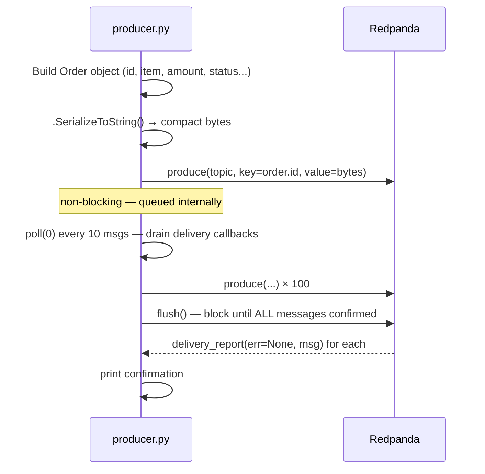

# Chapter 5 — Producer

> **You are here:** [Index](../README.md) → [Consumer Groups](./consumer-groups.md) → **Producer**

---

## What a producer does

A producer's job is simple: **take data, serialize it, send it to the right topic with the right key**.

The complexity is in the guarantees — making sure messages actually arrive, handling backpressure, and routing messages to the correct partition for ordering.

---

## ShipStream producer flow



---

## The partition key decision

```python
producer.produce(
    topic=TOPIC,
    key=order.id.encode(),        # ← this decides the partition
    value=order.SerializeToString(),
    callback=delivery_report,
)
```

Kafka hashes `order.id` → consistent partition assignment. All events for the same order always land on the same partition → consumer sees them in order.

**What happens without a key?** Kafka round-robins across partitions. Fine for independent events but breaks ordering for related events.

**Industry partition key examples:**

| Industry | Bad key choice | Good key choice | Why |
|----------|---------------|----------------|-----|
| Banking | None (round-robin) | `account_id` | Debit must be seen before overdraft check |
| Ride-sharing | `city` | `driver_id` | Location pings for one driver must be ordered |
| E-commerce | `product_id` | `order_id` | Order lifecycle events must be in sequence |
| IoT | None | `device_id` | Sensor readings must be in time order per device |
| Social | `timestamp` | `user_id` | A user's posts must appear in chronological order |

---

## Delivery guarantees

Kafka producers have three delivery modes:

| Mode | Config | Guarantee |
|------|--------|-----------|
| Fire-and-forget | No callback, no flush | Message may be lost |
| At-least-once | `callback` + `flush()` | Message delivered, possibly more than once on retry |
| Exactly-once | Idempotent producer + transactions | Delivered exactly once, most complex |

ShipStream uses **at-least-once**: the `delivery_report` callback confirms each message and `flush()` blocks until all are confirmed.

```python
def delivery_report(err, msg):
    if err:
        print(f"[ERROR] Delivery failed: {err}")
    else:
        print(f"[OK] partition={msg.partition()} offset={msg.offset()}")
```

---

## poll() inside the loop

```python
for i in range(COUNT):
    producer.produce(...)
    if i % 10 == 0:
        producer.poll(0)   # ← drain delivery callbacks without blocking
```

`produce()` is non-blocking — it queues messages in an internal buffer. If you never call `poll()`, the delivery callback queue fills up and the buffer backs up. Calling `poll(0)` every 10 messages keeps it drained without slowing the loop.

`flush()` at the end is a blocking `poll()` that waits until every queued message has been acknowledged.

---

## What the output tells you

```
[OK] partition=2 offset=37
[OK] partition=0 offset=12
[OK] partition=1 offset=9
```

The offsets are not sequential across partitions — each partition has its own counter. The partition is determined by hashing `order.id`. You have no control over which partition a message goes to (by design — the hash is deterministic given the key).

---

## Backpressure

If Redpanda is slow or unavailable, the internal buffer fills up. `produce()` will block once the buffer is full (`queue.buffering.max.messages`, default 100,000). This is Kafka's built-in backpressure mechanism — the producer slows down to match the broker's capacity.

---

> ← [Previous: Consumer Groups](./consumer-groups.md) | [Index](../README.md) | [Next: Consumer →](./consumer.md)
