# Kafka & Redpanda Threading Models II

> A deep-dive into how Kafka handles disk I/O, thread coordination, and how Redpanda's thread-per-core model eliminates the bottlenecks.

---

## Table of Contents

- [How Kafka Writes to Disk](#how-kafka-writes-to-disk)
- [Kafka Thread Architecture](#kafka-thread-architecture)
- [What Blocks an I/O Thread](#what-blocks-an-io-thread)
- [fsync: What "Blocked Until Durable" Means](#fsync-what-blocked-until-durable-means)
- [Do I/O Threads Own Fixed Partitions?](#do-io-threads-own-fixed-partitions)
- [Lock Contention & fsync Cascade](#lock-contention--fsync-cascade)
- [Durability vs Throughput Trade-off](#durability-vs-throughput-trade-off)
- [How Redpanda Solves This](#how-redpanda-solves-this-thread-per-core-model)

---

## How Kafka Writes to Disk

Kafka does **not** write directly to disk. It uses the **OS page cache** as an intermediary:

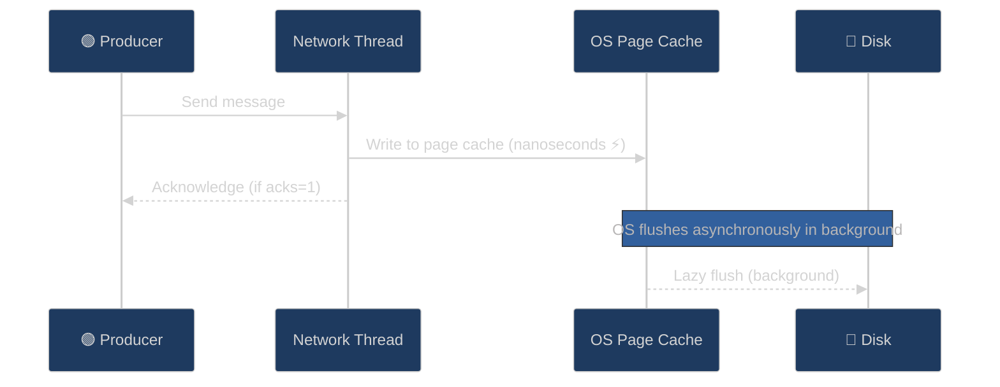

**Key insight**: The I/O thread only blocks for a **memory write** (nanoseconds), not an actual disk write — unless `fsync` is explicitly called.

---

## Kafka Thread Architecture

Kafka uses three separate thread pools. They operate independently — a slow I/O thread does **not** block a network thread.

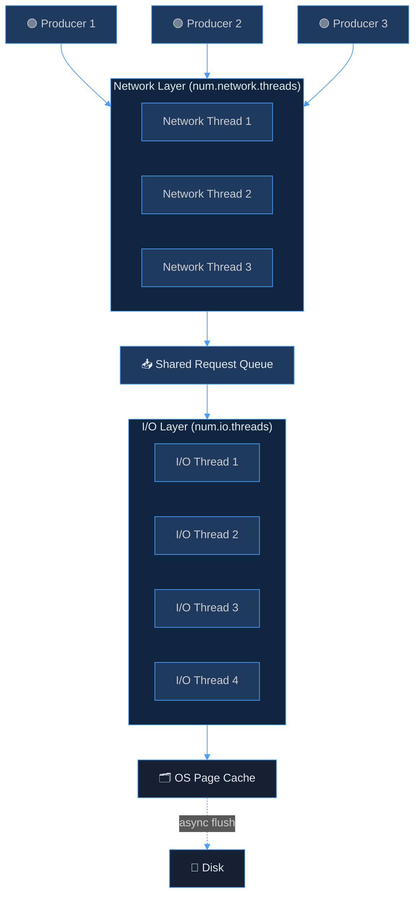

| Thread Pool | Config | Role |
|---|---|---|
| Network threads | `num.network.threads` | Handle socket connections, read/write from network |
| I/O threads | `num.io.threads` | Read/write to log segments on disk |
| Request handler threads | `num.io.threads` (shared) | Process produce/fetch/metadata requests |

---

## What Blocks an I/O Thread

| Scenario | Blocks? | Why |
|---|---|---|
| Write to OS page cache | ✅ No — near instant | Memory operation |
| `fsync` to disk | ❌ **Yes** — fully blocked | Waits for OS + disk confirmation |
| Cold read (not in page cache) | ❌ **Yes** — blocked on disk seek | Physical I/O required |
| Log segment rolling | ⚠️ Briefly | File system operation |

---

## fsync: What "Blocked Until Durable" Means

Think of it like saving a Word document:
- **Page cache write** = typing changes into RAM (instant, lost if power dies)
- **fsync** = clicking "Save" and waiting for the disk indicator — the thread is **frozen** until done

```mermaid
%%{init: {'theme': 'dark', 'themeVariables': {'primaryColor': '#1e3a5f', 'primaryTextColor': '#e2e8f0', 'primaryBorderColor': '#4a9eff', 'lineColor': '#4a9eff', 'secondaryColor': '#0f2540', 'background': '#0d1117', 'mainBkg': '#1e3a5f', 'nodeBorder': '#4a9eff', 'titleColor': '#e2e8f0', 'edgeLabelBackground': '#0d1117', 'activeTaskBorderColor': '#4a9eff', 'activeTaskBkgColor': '#1e3a5f', 'taskBkgColor': '#0f2540', 'taskBorderColor': '#4a9eff', 'taskTextColor': '#e2e8f0', 'taskTextLightColor': '#e2e8f0', 'critBkgColor': '#3d1a1a', 'critBorderColor': '#ff6b6b', 'sectionBkgColor': '#0d1117', 'altSectionBkgColor': '#0f2540', 'gridColor': '#2d3748', 'doneTaskBkgColor': '#1a3a1a', 'doneTaskBorderColor': '#4ade80'}}}%%
gantt
    title I/O Thread 3 — Timeline during fsync (flush.messages=1)
    dateFormat x
    axisFormat %Lms

    section Thread State
    Write msg-1 to page cache     :done,    t1, 0, 1
    fsync() called — BLOCKED      :crit,    t2, 1, 6
    Disk confirms — Thread free   :done,    t3, 6, 7
    Write msg-2 to page cache     :done,    t4, 7, 8
    fsync() called — BLOCKED      :crit,    t5, 8, 13
    Disk confirms — Thread free   :done,    t6, 13, 14
```

**Impact on throughput**: If disk latency is ~5ms and you fsync every message:
- Max throughput = **200 messages/sec** (1000ms ÷ 5ms)
- Without fsync: **hundreds of thousands/sec** (page cache = nanoseconds)

### `flush.messages=1` vs default

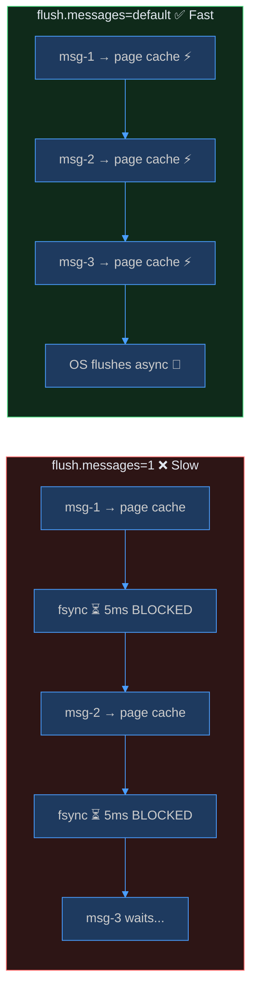

---

## Do I/O Threads Own Fixed Partitions?

**No.** Kafka uses a **shared thread pool** — any thread can handle any partition's request:

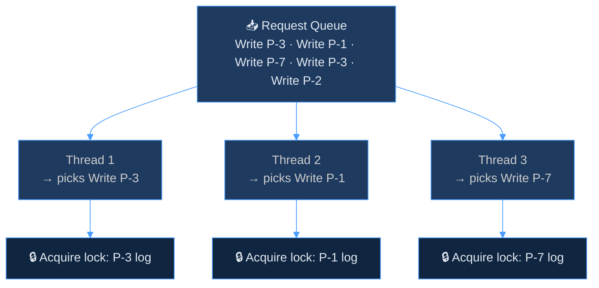

What actually **serializes per partition** is the **log file lock** — not the thread assignment.

---

## Lock Contention & fsync Cascade

When fsync blocks a thread, other threads trying to write to the same partition pile up on the lock:

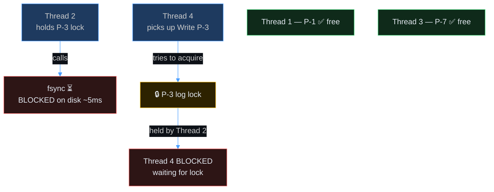

**Result**: One slow fsync can tie up **two threads** — one blocked on disk, one blocked on the lock — reducing effective thread pool capacity.

---

## Durability vs Throughput Trade-off

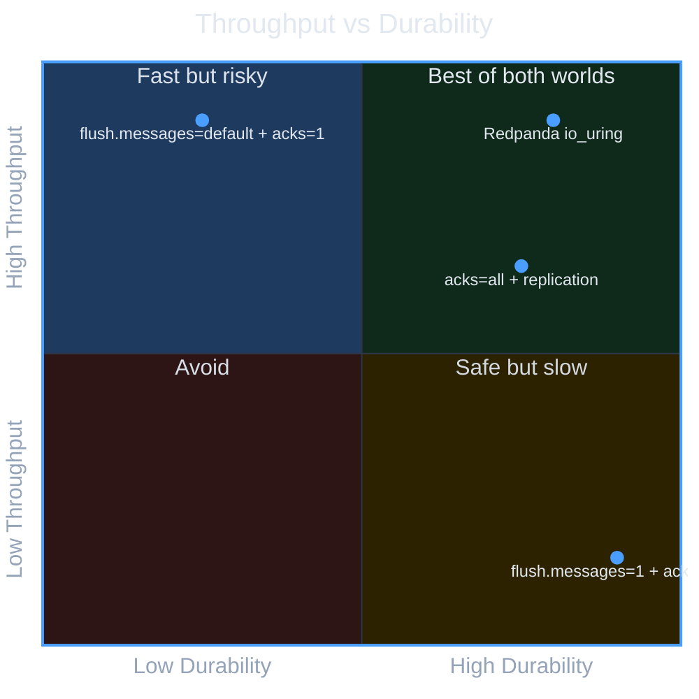

| Config | Throughput | Durability | Notes |
|---|---|---|---|
| `flush.messages=1` | 🔴 Very low | 🟢 Strongest | Survives power loss without replication |
| `flush.messages=default` | 🟢 Very high | 🟡 Weaker | Relies on OS + replication |
| `acks=all` + replicas | 🟡 Medium | 🟢 Strong | Recommended Kafka approach |
| Redpanda (`io_uring`) | 🟢 Very high | 🟢 Strong | Async fsync, no thread blocking |

> **Kafka's recommended approach**: skip frequent fsyncs, use `acks=all` + `min.insync.replicas=2`. If 3 brokers hold data in page cache, a single machine's power loss doesn't matter.

---

## How Redpanda Solves This: Thread-per-Core Model

Redpanda uses the **Seastar framework** where each CPU core **permanently owns** a fixed set of partitions.

### Architecture Comparison

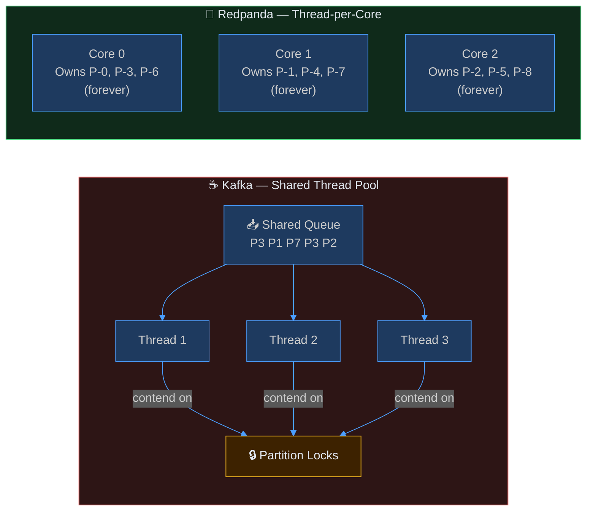

### Redpanda's Async Event Loop (io_uring)

Each core runs a **single-threaded async event loop**. Even fsync doesn't block:

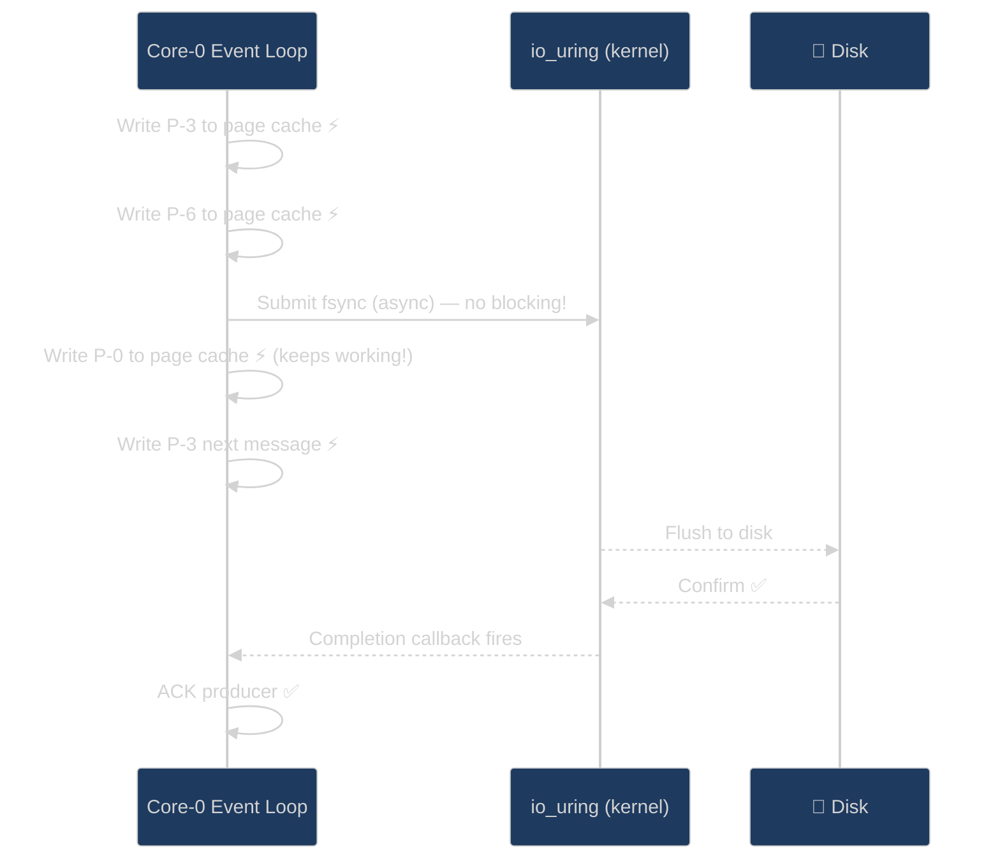

### Cross-Core Communication

When a request arrives at the wrong core, Redpanda uses **lock-free message passing**:

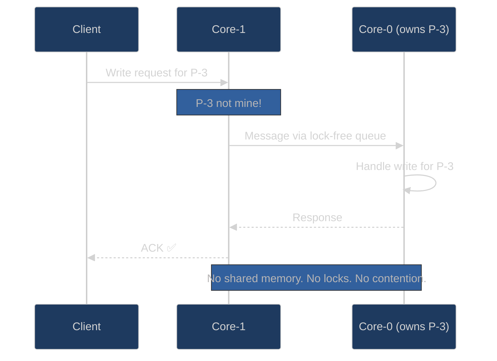

### What Redpanda Eliminates

| Problem in Kafka | Root Cause | Redpanda Fix |
|---|---|---|
| Lock contention on partition log | Multiple threads share one partition | One core owns each partition — no lock needed |
| fsync blocking threads | Blocking syscall freezes thread | `io_uring` submits async, core keeps working |
| fsync cascade (lock + disk wait) | Thread holds lock during fsync | No locks to hold |
| Thread pool exhaustion | Hot partitions monopolize threads | Each core is isolated — hot partition stays on its core |
| Context switching overhead | OS schedules many threads | Each core runs a tight loop, no preemption |

### Net Result

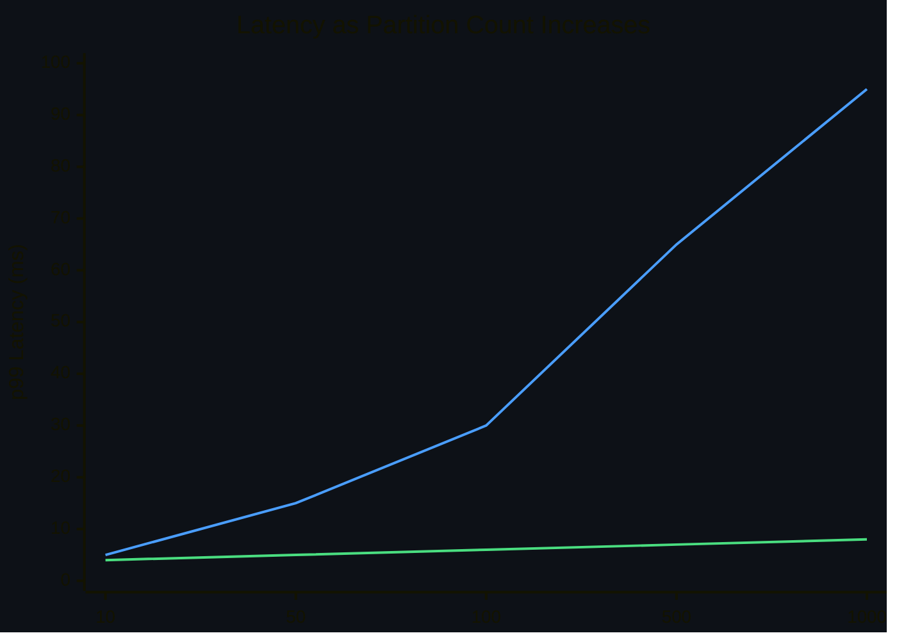

- **Kafka**: more partitions → more lock contention → latency grows
- **Redpanda**: more partitions → evenly spread across cores → latency stays flat

---
