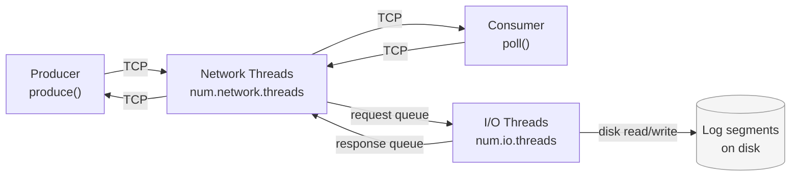
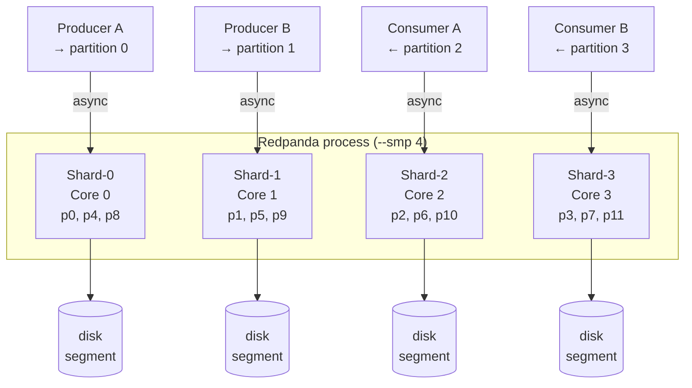
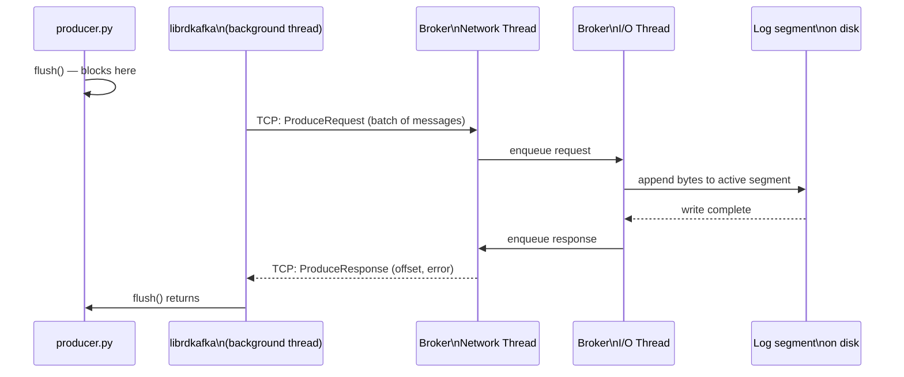
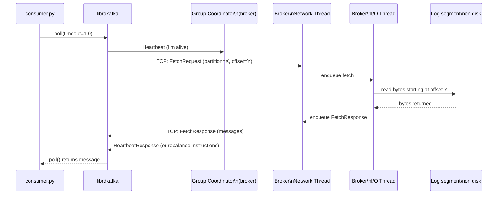
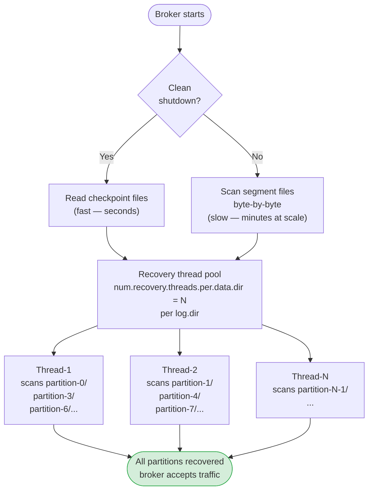

# Chapter 25 — Threading Models: Kafka vs Redpanda

> **You are here:** [Index](../README.md) → [Topic Defaults](./topic-defaults.md) → **Threading Models**

---

Kafka and Redpanda both handle concurrent producers and consumers, but their internal concurrency models are fundamentally different. Understanding this makes the broker config knobs — and why Redpanda has fewer of them — make sense.

It also explains what actually happens inside the broker when you call `producer.flush()` or `consumer.poll()`.

---

## The JVM thread pool model (Apache Kafka)

Kafka is a JVM application. It uses a classic thread-pool architecture: a fixed number of threads compete for CPU time, managed by the OS scheduler.

There are three distinct thread pools, each with its own config:

```
Incoming network request
        │
        ▼
┌─────────────────────┐
│  Network Threads    │  num.network.threads (default: 3)
│  Thread-1           │  Accept connections, read bytes off the socket
│  Thread-2           │  Place request onto shared request queue
│  Thread-3           │
└────────┬────────────┘
         │  shared request queue (blocking queue with a lock)
         ▼
┌─────────────────────┐
│  I/O Threads        │  num.io.threads (default: 8)
│  Thread-1           │  Dequeue request, write to / read from disk
│  Thread-2           │  Place response onto response queue
│  ...                │
│  Thread-8           │
└────────┬────────────┘
         │  response queue
         ▼
┌─────────────────────┐
│  Network Threads    │  (same pool, now sending responses back)
└─────────────────────┘
```

**num.network.threads** — Threads that sit on the network socket. They accept connections, read incoming bytes, and hand off parsed requests to the I/O threads. They also send responses back to clients.

**num.io.threads** — Threads that do the actual disk work. They dequeue a request (produce, fetch, etc.), call into the log storage layer to write or read segment files, then put the response back for the network threads to send.

**num.recovery.threads.per.data.dir** — A separate, temporary thread pool that exists only during startup. Each thread scans partition directories looking for the last clean offset. Once recovery is complete, this pool is shut down and the threads are released. It plays no role in normal message I/O.



### The lock problem

The shared request queue between network threads and I/O threads is a blocking queue backed by a lock. Under high load:

- Many network threads are trying to enqueue requests simultaneously
- Many I/O threads are trying to dequeue simultaneously
- Each operation acquires and releases the lock

This is manageable at moderate concurrency but becomes a bottleneck when you have many threads competing — adding more I/O threads past a certain point stops helping because they all starve on the lock.

---

## The Seastar shared-nothing model (Redpanda)

Redpanda is built on the [Seastar](https://seastar.io) C++ framework, which uses a completely different approach.

**One thread per CPU core. Each thread is called a shard. Shards never share data.**

```
                  ┌──────────────────────────────────┐
                  │          Redpanda process         │
                  │                                  │
  --smp 4 →       │  Shard-0  Shard-1  Shard-2  Shard-3  │
                  │  Core 0   Core 1   Core 2   Core 3   │
                  │                                  │
                  │  owns     owns     owns     owns  │
                  │  p0,p4    p1,p5    p2,p6    p3,p7 │
                  └──────────────────────────────────┘
```

Each shard owns a fixed set of partitions. A network connection that arrives on Shard-0 and targets a partition owned by Shard-2 is handed off via a lock-free message passing channel — the shards never touch each other's memory directly.

Because each shard is single-threaded and owns its data exclusively, there are no locks needed for disk I/O or partition state. The absence of locking is what allows Redpanda to scale more linearly as core count increases.



### Async I/O: no blocking

In Kafka's I/O threads, when a thread issues a disk read it **blocks** — the thread sits idle waiting for the OS to return data. This is why Kafka needs a pool of 8 threads: while 3 are blocked on disk reads, others can keep processing.

Seastar uses Linux `io_uring` (or `libaio`) for async I/O. A shard issues a disk read, registers a callback, and immediately moves on to handle other work. When the OS signals the read is complete, the shard runs the callback. No blocking, no idle waiting.

```
Kafka I/O thread doing a fetch:
  dequeue request → issue disk read → BLOCKED (idle) → read returns → send response

Seastar shard doing a fetch:
  receive request → issue async disk read → handle other requests → callback fires → send response
```

This means one Seastar shard can have dozens of disk operations in flight simultaneously without needing more threads. It's why Redpanda doesn't need a `num.io.threads` knob at all.

---

## Side-by-side comparison

| | Apache Kafka (JVM) | Redpanda (Seastar) |
|---|---|---|
| Concurrency model | Thread pools | One thread per core (shard) |
| I/O style | Blocking (thread sleeps waiting for disk) | Async (thread issues read and moves on) |
| Shared state | Yes — queues with locks between pools | No — each shard owns its partitions |
| Recovery threads | Separate pool (`num.recovery.threads.per.data.dir`) | Same shards that own the partition |
| Tuning knobs | `num.network.threads`, `num.io.threads`, `num.recovery.threads.per.data.dir` | `--smp N` (core count only) |
| Lock contention at scale | Yes, especially on request queues | No |
| Weakness | Adding threads past lock saturation point stops helping | Imbalanced partition sizes can't borrow work across shards |

---

## How poll() and flush() connect to broker threads

When you call `producer.flush()` or `consumer.poll()` in Python, here is the full chain of what happens on the broker side.

### Producer flush() path



`flush()` doesn't talk to the broker directly — your Python code hands the messages to librdkafka's background thread, which batches them and sends the ProduceRequest over TCP. The broker's network threads receive it, hand it to I/O threads, which append to the segment file. The ack travels back the same way, and only once librdkafka receives it does `flush()` unblock your code.

In Redpanda, the "network thread → I/O thread handoff" doesn't exist — the shard that received the TCP connection owns the partition and handles the write directly.

### Consumer poll() path



Every `consumer.poll()` call sends both a FetchRequest (for messages) and a Heartbeat (for group liveness) to the broker. The I/O thread does the actual disk read to find messages at the requested offset. If the Heartbeat is late (you stopped calling `poll()`), the group coordinator declares the consumer dead and triggers a rebalance — that's the liveness contract enforced at the broker level.

---

## num.recovery.threads.per.data.dir revisited

With this threading model in mind, here is what happens at Kafka startup:



With `threads=1` and 60 partitions, each partition is scanned one at a time. With `threads=6`, six partitions are scanned simultaneously. Recovery time drops roughly linearly until you hit disk I/O saturation.

After recovery completes, this thread pool is torn down. The normal `num.network.threads` and `num.io.threads` pools take over for the lifetime of the broker.

In Redpanda, there is no separate recovery pool. The shard that owns each partition runs its own recovery scan for those partitions during startup, then transitions directly to serving live traffic on the same thread.

---

## Summary

- Kafka uses **three thread pools** for different stages of request handling. All three are always tunable because each pool can become a bottleneck independently.
- Redpanda uses **one thread per core** with async I/O. No lock contention, no I/O blocking. The only knob is `--smp` (how many cores to use).
- `producer.flush()` blocks until the broker's I/O threads have written your messages to a log segment and sent an ack back across the network.
- `consumer.poll()` triggers a FetchRequest (read from log segment) and a Heartbeat (liveness signal) — both go through the broker's thread layers.
- `num.recovery.threads.per.data.dir` is a startup-only pool. It has zero effect on steady-state throughput — only on how fast the broker comes back online after a restart.

---

> ← [Previous: Topic Defaults](./topic-defaults.md) | [Index](../README.md)
