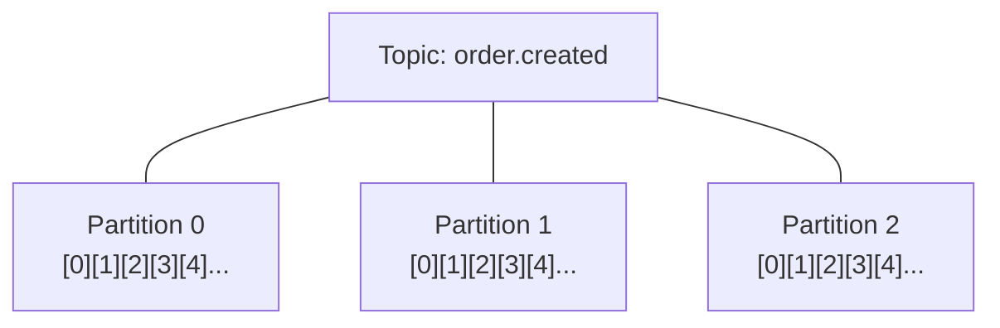
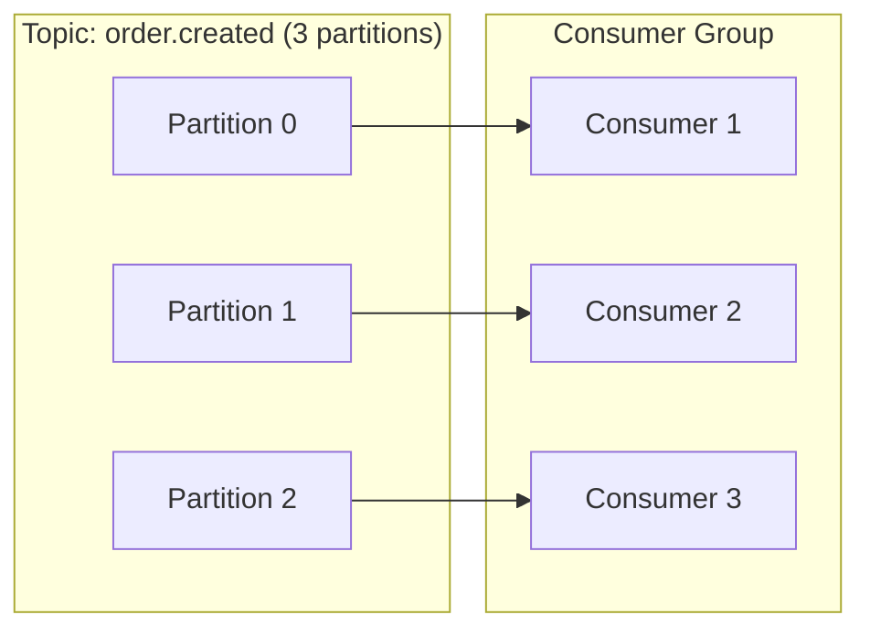

# Chapter 2 — Topics & Partitions

> **You are here:** [Index](../README.md) → [What is Kafka?](./what-is-kafka.md) → **Topics & Partitions**

---

## Topics

A **topic** is a named, durable, append-only log. Think of it as a category of events.

| Industry | Topic name | What goes in it |
|----------|-----------|----------------|
| E-commerce | `order.created` | Every new order placed |
| Banking | `payment.processed` | Every payment cleared |
| Ride-sharing | `driver.location.updated` | Every GPS ping from every driver |
| Healthcare | `patient.vitals.recorded` | Every reading from monitoring devices |
| Gaming | `player.action` | Every in-game event from every player |

Topics are **not queues**. A queue deletes a message once it's consumed. A Kafka topic retains messages for a configurable period (default 7 days) regardless of how many times they've been read. Ten different services can read the same topic; none of them affects the others.

```
Traditional Queue          Kafka Topic
──────────────────         ──────────────────────────────
[A][B][C][D]               [A][B][C][D][E][F][G]
Consumer reads A           Consumer A reads at offset 3
→ A is deleted             Consumer B reads at offset 1
→ B is next for everyone   Consumer C reads at offset 6
                           → all independent, nothing deleted
```

---

## Partitions

A topic is split into **partitions** — independent sub-logs that can live on different broker nodes and be consumed in parallel.



Each partition is its own independent append-only log. Offset 4 in partition 0 is a completely different message from offset 4 in partition 1.

---

## The partition key

When producing, you supply a **key**. Kafka hashes the key to determine which partition the message goes to. Same key always → same partition.

```python
producer.produce(
    topic="order.created",
    key=order.id.encode(),   # ← hashed to pick partition
    value=order.SerializeToString(),
)
```

### Why this matters: ordering

Messages within a partition are always in order. Messages across partitions have no ordering guarantee.

By keying on `order.id`, all events for a given order (CREATED → PAID → FULFILLED) always land on the same partition — so downstream consumers see them in the correct sequence.

**Industry examples of partition key choices:**

| Industry | Key | Why |
|----------|-----|-----|
| E-commerce | `order_id` | All state transitions for one order stay ordered |
| Banking | `account_id` | Debit/credit events for one account stay ordered |
| Ride-sharing | `driver_id` | GPS pings for one driver stay ordered |
| Social media | `user_id` | A user's posts stay in chronological order |
| IoT | `device_id` | Sensor readings from one device stay ordered |

---

## Partitions = parallelism ceiling

The number of partitions is the **maximum number of consumers** that can actively read a topic simultaneously within one consumer group.

```
3 partitions, 3 consumers  ✅  each consumer owns one partition
3 partitions, 5 consumers  ⚠️  2 consumers sit idle — nothing to assign them
3 partitions, 1 consumer   ✅  one consumer reads all 3 partitions (no parallelism)
```



---

## Partition count is a critical decision

Partitions are set at topic creation. Increasing them later is possible but disrupts key-based routing (the same key will hash to a different partition after the count changes). **Size generously upfront.**

Rule of thumb: estimate your peak throughput, divide by what one consumer can handle, round up, then double it for headroom.

```bash
# Create with 3 partitions
docker exec redpanda rpk topic create order.created --partitions 3

# Inspect
docker exec redpanda rpk topic describe order.created
```

---

> ← [Previous: What is Kafka?](./what-is-kafka.md) | [Index](../README.md) | [Next: Offsets →](./offsets.md)
