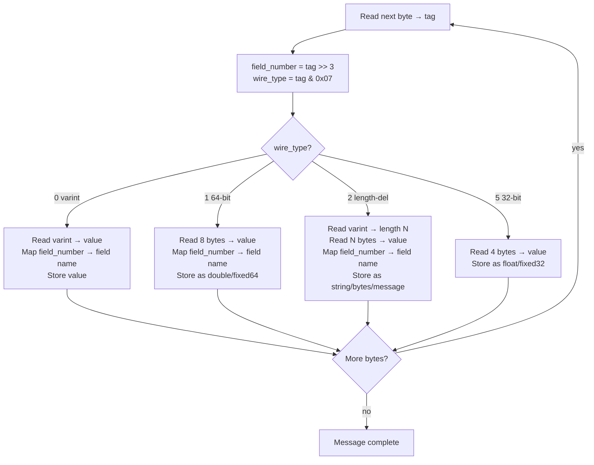

# Chapter 10 — Binary Encoding

> **You are here:** [Index](../README.md) → [Proto Schema](./proto-schema.md) → **Binary Encoding**

This chapter tears open a real Protobuf message byte by byte. By the end you'll be able to read raw protobuf hex and know exactly what every bit means.

---

## The real bytes of a ShipStream Order

This is an actual `Order` message serialized by `order.SerializeToString()`:

```python
Order(
    id          = "abc",
    customer_id = "c-42",
    item        = "Keyboard",
    amount      = 149.99,
    status      = ORDER_STATUS_CREATED,  # = 1
)
```

**Raw bytes (32 bytes total):**

```
0a 03 61 62 63 12 04 63 2d 34 32 1a 08 4b 65 79
62 6f 61 72 64 21 48 e1 7a 14 ae bf 62 40 28 01
```

**Annotated byte map:**

```
Offset  Hex                                  Meaning
──────  ───────────────────────────────────  ─────────────────────────────────
00      0a                                   TAG: field=1, wire_type=2 (string)
01      03                                   LENGTH: 3 bytes follow
02-04   61 62 63                             VALUE: "abc"  (a=0x61 b=0x62 c=0x63)

05      12                                   TAG: field=2, wire_type=2 (string)
06      04                                   LENGTH: 4 bytes follow
07-10   63 2d 34 32                          VALUE: "c-42" (c=0x63 -=0x2d 4=0x34 2=0x32)

11      1a                                   TAG: field=3, wire_type=2 (string)
12      08                                   LENGTH: 8 bytes follow
13-20   4b 65 79 62 6f 61 72 64             VALUE: "Keyboard"

21      21                                   TAG: field=4, wire_type=1 (64-bit double)
22-29   48 e1 7a 14 ae bf 62 40             VALUE: 149.99 (IEEE 754, little-endian)

30      28                                   TAG: field=5, wire_type=0 (varint enum)
31      01                                   VALUE: 1 (ORDER_STATUS_CREATED)
```

**Visual layout:**

```
┌────┬────┬────┬────┬────┬────┬────┬────┬────┬────┬────┬────┬────┬────┬────┬────┐
│ 0a │ 03 │ 61 │ 62 │ 63 │ 12 │ 04 │ 63 │ 2d │ 34 │ 32 │ 1a │ 08 │ 4b │ 65 │ 79 │
├────┼────┴────┴────┘    └────┼────┴────┴────┴────┘    └────┼────┴────┴────┴────
│tag │   "abc" (3 bytes)      │tag │   "c-42" (4 bytes)     │tag │  "Keyboard"...
│ f1 │                        │ f2 │                         │ f3 │
└────┘                        └────┘                         └────┘

┌────┬────┬────┬────┬────┬────┬────┬────┬────┬────┬────┬────┐
│ 62 │ 6f │ 61 │ 72 │ 64 │ 21 │ 48 │ e1 │ 7a │ 14 │ ae │ bf │
├────┴────┴────┴────┘    └────┼────┴────┴────┴────┴────┴────
│ ...Keyboard (continued)     │tag │    149.99 (8 bytes)...
│                             │ f4 │
└─────────────────────────────└────┘

┌────┬────┬────┬────┬────┐
│ 62 │ 40 │ 28 │ 01 │    │
├────┴────┘    └────┴────┘
│ ...149.99   │tag │ 1  │
│             │ f5 │    │
└─────────────└────┴────┘
```

---

## The tag byte — decoding field number and wire type

The very first thing the decoder reads for each field is a **tag byte** (sometimes multiple bytes for large field numbers). It encodes two things in one:

```
tag = (field_number << 3) | wire_type
```

```
Tag 0x0a (decimal 10):
┌─────────────────────────────────────────┐
│  Bits:  7   6   5   4   3   2   1   0  │
│         0   0   0   0   1   0   1   0  │
│         └───────────────┘   └───────┘  │
│           field_number = 1   wire = 2  │
└─────────────────────────────────────────┘
  field_number = 0x0a >> 3 = 1
  wire_type    = 0x0a & 0x7 = 2  ← length-delimited (string)

Tag 0x21 (decimal 33):
┌─────────────────────────────────────────┐
│  Bits:  7   6   5   4   3   2   1   0  │
│         0   0   1   0   0   0   0   1  │
│         └───────────────┘   └───────┘  │
│           field_number = 4   wire = 1  │
└─────────────────────────────────────────┘
  field_number = 0x21 >> 3 = 4
  wire_type    = 0x21 & 0x7 = 1  ← 64-bit (double)
```

**All tags in this message:**

```
0x0a = 00001 010 → field 1, wire type 2 (length-delimited) → string id
0x12 = 00010 010 → field 2, wire type 2 (length-delimited) → string customer_id
0x1a = 00011 010 → field 3, wire type 2 (length-delimited) → string item
0x21 = 00100 001 → field 4, wire type 1 (64-bit)           → double amount
0x28 = 00101 000 → field 5, wire type 0 (varint)            → enum status
```

---

## Varint encoding — variable-length integers

Varints are how Protobuf encodes integers without wasting bytes. The idea: small numbers (which are common) take fewer bytes than large numbers.

**The rule:**
- Each byte uses its **7 low bits** for data
- The **MSB (bit 7)** is a continuation flag: `1` = more bytes follow, `0` = last byte
- Values 0–127 encode in **1 byte**
- Values 128–16383 encode in **2 bytes**

```
Encoding 1 (our status field):
  1 = 0b0000001
  Fits in 7 bits → single byte, MSB = 0 (no more bytes)
  ┌──────────────────────────────────────────┐
  │  MSB  bit6 bit5 bit4 bit3 bit2 bit1 bit0 │
  │   0    0    0    0    0    0    0    1   │ = 0x01
  └──────────────────────────────────────────┘

Encoding 127:
  127 = 0b1111111
  Fits in 7 bits → single byte, MSB = 0
  ┌──────────────────────────────────────────┐
  │   0    1    1    1    1    1    1    1   │ = 0x7f
  └──────────────────────────────────────────┘

Encoding 128:
  128 = 0b10000000  → needs 8 bits, won't fit in 7
  Split into 7-bit groups (from LSB):
    group 1 (low):  000 0000  → more bytes follow, set MSB=1: 1000 0000 = 0x80
    group 2 (high): 000 0001  → last byte, MSB=0:             0000 0001 = 0x01
  ┌──────────────────────────────────────────┐
  │  Byte 1: 1 0 0 0 0 0 0 0 │ Byte 2: 0 0 0 0 0 0 0 1 │
  │          ▲ └─────────────┘         ▲ └─────────────┘│
  │         cont  7 data bits         stop  7 data bits  │
  └──────────────────────────────────────────────────────┘
  Result: 0x80 0x01

Encoding 300:
  300 = 0b100101100
  Split into 7-bit groups (from LSB):
    group 1 (low 7 bits):  010 1100 = 44  → more follows: 1010 1100 = 0xac
    group 2 (high 2 bits): 000 0010 = 2   → last byte:    0000 0010 = 0x02
  Result: 0xac 0x02
```

**Varint size table:**

```
Value range          Bytes needed    Examples
──────────────────   ────────────    ───────────────────────────────
0 – 127              1 byte          enum values, boolean, small IDs
128 – 16,383         2 bytes         medium integers
16,384 – 2,097,151   3 bytes         larger counts
2M – 268M            4 bytes         getting large
> 268M               5 bytes         rare for int32
```

**The practical implication:** If you use `int32` for a field that's usually a small number (like an enum or a count), it's very efficient. But if you store `-1` in an `int32`, Protobuf encodes it as a 10-byte varint (because `-1` in two's complement is all 1s = a very large number). Use `sint32` for negative numbers — it uses zigzag encoding and stays small.

---

## Length-delimited encoding (strings, bytes, nested messages)

Wire type 2 always follows the pattern: **tag → varint(length) → raw bytes**

```
Field 3, item = "Keyboard" (8 characters):

Step 1 — Tag byte
  field=3, wire_type=2 → (3 << 3) | 2 = 26 = 0x1a

Step 2 — Length as varint
  8 fits in 7 bits → 0x08

Step 3 — Raw UTF-8 bytes
  K=0x4b  e=0x65  y=0x79  b=0x62  o=0x6f  a=0x61  r=0x72  d=0x64

Combined on the wire:
  ┌──────┬──────┬──────┬──────┬──────┬──────┬──────┬──────┬──────┬──────┐
  │ 0x1a │ 0x08 │ 0x4b │ 0x65 │ 0x79 │ 0x62 │ 0x6f │ 0x61 │ 0x72 │ 0x64 │
  └──────┴──────┴──────┴──────┴──────┴──────┴──────┴──────┴──────┴──────┘
   tag    len   K      e      y      b      o      a      r      d
```

---

## 64-bit fixed encoding (double)

Wire type 1 is the simplest: always exactly 8 bytes in **little-endian** order.

```
Field 4, amount = 149.99 (double):

Step 1 — Tag byte
  field=4, wire_type=1 → (4 << 3) | 1 = 33 = 0x21

Step 2 — IEEE 754 double representation
  149.99 in IEEE 754 64-bit (big-endian):  40 62 bf ae 14 7a e1 48
  Reversed to little-endian (wire format): 48 e1 7a 14 ae bf 62 40

IEEE 754 double anatomy for 149.99:
┌───┬──────────────────────────────────────────────────────────────────┐
│ S │  Exponent (11 bits)   │         Mantissa (52 bits)              │
│ 0 │  100 0000 0110        │  0010 1011 1111 1010 1110 0001 0111 1010│
│   │                       │  0001 0100 1010 1110 0111 0101 0001 1000│
└───┴──────────────────────────────────────────────────────────────────┘
  S=0 (positive)
  Exponent = 1030, biased by 1023 → actual exponent = 7 (so 2^7 = 128)
  Value ≈ 1.17178... × 128 = 149.99

On the wire (tag + 8 bytes little-endian):
  ┌──────┬──────┬──────┬──────┬──────┬──────┬──────┬──────┬──────┐
  │ 0x21 │ 0x48 │ 0xe1 │ 0x7a │ 0x14 │ 0xae │ 0xbf │ 0x62 │ 0x40 │
  └──────┴──────┴──────┴──────┴──────┴──────┴──────┴──────┴──────┘
   tag    ← ─────────── 8 bytes, little-endian ──────────────── →
```

---

## The decoding algorithm



---

## Zero values are not written

In proto3, fields set to their zero value are **omitted from the wire entirely**.

```python
order = Order(
    id="abc",
    amount=0.0,          # zero value for double → NOT written
    status=0,            # ORDER_STATUS_UNSPECIFIED → NOT written
)
# Wire only contains: field 1 (id)
```

This means:
- Smaller messages when fields are unset
- A missing field and a zero-value field are **indistinguishable** on the wire
- Don't use 0 as a meaningful enum value — `ORDER_STATUS_UNSPECIFIED = 0` exists for this reason

---

## Inspecting bytes in Python

```python
order = Order(id="abc", customer_id="c-42", item="Keyboard",
              amount=149.99, status=OrderStatus.ORDER_STATUS_CREATED)

raw = order.SerializeToString()
print(f"Size: {len(raw)} bytes")
print(f"Hex:  {raw.hex()}")
print(f"Hex spaced: {' '.join(f'{b:02x}' for b in raw)}")

# Decode tag manually
first_byte = raw[0]
print(f"First tag: 0x{first_byte:02x}")
print(f"  field number: {first_byte >> 3}")
print(f"  wire type:    {first_byte & 0x7}")
```

Output:
```
Size: 32 bytes
Hex:  0a036162631204632d34321a084b6579626f617264214...
Hex spaced: 0a 03 61 62 63 12 04 63 2d 34 32 1a 08 4b ...
First tag: 0x0a
  field number: 1
  wire type:    2
```

---

## Why fields can appear in any order

The decoder never assumes fields arrive in field-number order. It reads a tag, jumps to the right field, then reads the next tag. This means:

- A producer can send fields in any order
- Unknown field numbers are skipped (enabling forward compatibility)
- The same field can technically appear multiple times (last value wins for scalars)

This is fundamentally different from a fixed binary format like a C struct, where position is everything. Protobuf is **self-describing at the field level**.

---

> ← [Previous: Proto Schema](./proto-schema.md) | [Index](../README.md) | [Next: Compile Workflow →](./compile-workflow.md)
