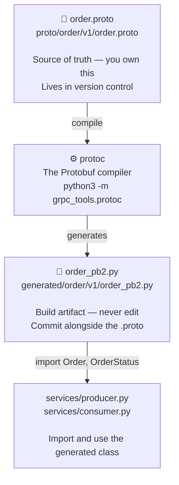
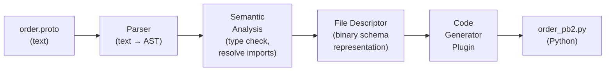

# Chapter 11 — Compile Workflow

> **You are here:** [Index](../README.md) → [Binary Encoding](./binary-encoding.md) → **Compile Workflow**

---

## The three layers



The `.proto` file is **source code** — reviewed, versioned, branched like any other code.

The `_pb2.py` file is a **build artifact** — like a compiled `.o` file. You commit it for convenience (no build step for teammates) but never edit it.

---

## The compile command

```bash
python3 -m grpc_tools.protoc \
  -I proto \
  --python_out=generated \
  proto/order/v1/order.proto
```

| Flag | Meaning |
|------|---------|
| `-I proto` | Import root — `protoc` looks here to resolve `import "google/protobuf/timestamp.proto"` |
| `--python_out=generated` | Write Python output into `generated/`, mirroring the directory structure of the input |
| `proto/order/v1/order.proto` | The file to compile |

The output path mirrors the input: `proto/order/v1/order.proto` → `generated/order/v1/order_pb2.py`.

---

## What protoc does internally



1. **Parse** — reads the `.proto` text and builds an Abstract Syntax Tree
2. **Semantic analysis** — resolves `import` statements, checks field number uniqueness, validates types
3. **File Descriptor** — serializes the entire schema as a binary `FileDescriptorProto` message (yes, Protobuf uses Protobuf to describe itself)
4. **Code generation** — the Python plugin receives the file descriptor and emits `_pb2.py`

---

## Inside the generated file

```python
# generated/order/v1/order_pb2.py

from google.protobuf.internal import builder as _builder
from google.protobuf import descriptor as _descriptor
from google.protobuf import descriptor_pool as _descriptor_pool
from google.protobuf import symbol_database as _symbol_database

_sym_db = _symbol_database.Default()

from google.protobuf import timestamp_pb2 as google_dot_protobuf_dot_timestamp__pb2

# ← This is the entire schema, pre-serialized as bytes
DESCRIPTOR = _descriptor_pool.Default().AddSerializedFile(
    b'\n\x14order/v1/order.proto\x12\x08order.v1\x1a\x1fgoogle/protobuf/timestamp.proto'
    b'\"\x9d\x01\n\x05Order\x12\n\n\x02id\x18\x01 \x01(\t\x12\x13\n\x0b\x63ustomer_id'
    b'\x18\x02 \x01(\t\x12\x0c\n\x04item\x18\x03 \x01(\t\x12\x0e\n\x06\x61mount\x18'
    b'\x04 \x01(\x01\x12%\n\x06status\x18\x05 \x01(\x0e\x32\x15.order.v1.OrderStatus'
    b'\x12.\n\ncreated_at\x18\x06 \x01(\x0b\x32\x1a.google.protobuf.Timestamp...'
)

# ← This builds the Python Order class from the descriptor above
_builder.BuildMessageAndEnumDescriptors(DESCRIPTOR, globals())
_builder.BuildTopDescriptorsAndMessages(DESCRIPTOR, 'order.v1.order_pb2', globals())
```

That `b'\n\x14order/v1/...'` blob **is the schema**, encoded as a serialized `FileDescriptorProto` Protobuf message. Protobuf uses itself to describe itself — the schema is stored in binary Protobuf format inside the generated Python file.

The `builder` calls read that descriptor at import time and dynamically construct the `Order` Python class with all its fields, validators, and serialize/deserialize methods.

---

## What `_builder` creates

When you do `from generated.order.v1.order_pb2 import Order`, Python:

1. Executes the module — loads the serialized descriptor into the runtime pool
2. `BuildMessageAndEnumDescriptors` — registers `Order` and `OrderStatus` in the descriptor pool
3. `BuildTopDescriptorsAndMessages` — creates the Python class objects and injects them into `globals()`

After this, `Order` is a fully functional Python class with:
- Constructor accepting all field names as kwargs
- Attribute access for each field
- `SerializeToString()` method
- `ParseFromString()` method
- `ByteSize()`, `ListFields()`, `HasField()`, `ClearField()` and more

---

## The `__init__.py` files

Three empty files make the `generated/` tree importable as Python packages:

```
generated/
├── __init__.py              ← marks generated/ as a package
└── order/
    ├── __init__.py          ← marks order/ as a package
    └── v1/
        ├── __init__.py      ← marks v1/ as a package
        └── order_pb2.py     ← the module
```

Python's import system requires `__init__.py` at every directory level between the root and the module. Without them:

```python
from generated.order.v1.order_pb2 import Order
# ModuleNotFoundError: No module named 'generated.order'
```

With them, each directory level is treated as a sub-package, and the full dotted path resolves correctly.

---

## When to regenerate

Any time `order.proto` changes:

```bash
# 1. Edit the schema
vim proto/order/v1/order.proto

# 2. Regenerate (overwrites order_pb2.py)
python3 -m grpc_tools.protoc \
  -I proto \
  --python_out=generated \
  proto/order/v1/order.proto

# 3. Commit both files together
git add proto/order/v1/order.proto generated/order/v1/order_pb2.py
git commit -m "add shipping_address field to Order"
```

Never commit a changed `.proto` without regenerating and committing the `_pb2.py` — teammates pulling the change would get a schema mismatch between what the proto says and what the Python class does.

---

## Directory layout in context

```
shipstream/
├── proto/                        ← source (you own)
│   └── order/
│       └── v1/
│           └── order.proto
│
├── generated/                    ← output (never edit)
│   ├── __init__.py
│   └── order/
│       ├── __init__.py
│       └── v1/
│           ├── __init__.py
│           └── order_pb2.py
│
└── services/
    ├── producer.py               ← from generated.order.v1.order_pb2 import Order
    └── consumer.py
```

---

> ← [Previous: Binary Encoding](./binary-encoding.md) | [Index](../README.md) | [Next: Python Usage →](./python-usage.md)
