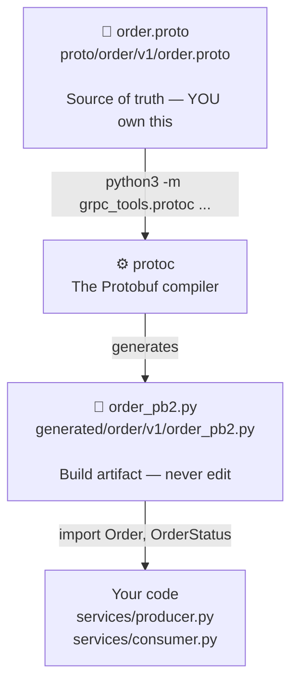

# Chapter 10 — Compile Workflow

> **You are here:** [Index](../README.md) → [Proto Schema](./proto-schema.md) → **Compile Workflow**

---

## The three layers



The `.proto` file is **source code** — it lives in version control, gets code-reviewed, follows your branching strategy.

The `_pb2.py` file is a **build artifact** — like a compiled `.o` file or a minified JS bundle. You commit it for convenience (no build step needed to run the project) but you never edit it directly.

---

## The compile command

```bash
python3 -m grpc_tools.protoc \
  -I proto \
  --python_out=generated \
  proto/order/v1/order.proto
```

| Part | Meaning |
|------|---------|
| `python3 -m grpc_tools.protoc` | Run the protoc compiler via the Python package |
| `-I proto` | Set `proto/` as the import root (for resolving `import "google/protobuf/timestamp.proto"`) |
| `--python_out=generated` | Write the Python output into the `generated/` directory |
| `proto/order/v1/order.proto` | The input file to compile |

---

## What gets generated

`generated/order/v1/order_pb2.py` — the Python class for `Order` and `OrderStatus`.

The binary blob inside it is the **serialized file descriptor** — the entire schema encoded as bytes that the Protobuf runtime uses to know how to encode/decode each field:

```python
DESCRIPTOR = _descriptor_pool.Default().AddSerializedFile(
    b'\n\x14order/v1/order.proto\x12\x08order.v1...'
)
```

You never interact with this directly. The `Order` class built on top of it gives you a clean Python API.

---

## The `__init__.py` files

Three empty files in the `generated/` tree:

```
generated/
├── __init__.py          ← marks generated/ as a Python package
└── order/
    ├── __init__.py      ← marks order/ as a Python package
    └── v1/
        ├── __init__.py  ← marks v1/ as a Python package
        └── order_pb2.py
```

Without these, Python treats the directories as plain folders and this import fails:

```python
from generated.order.v1.order_pb2 import Order
#    ^^^^^^^^^  ^^^^^  ^^
#    needs __init__.py at each level
```

They are empty files. Their only job is to signal "this directory is a Python package."

---

## When to regenerate

Any time `order.proto` changes — new field, new enum value, new message type, renamed field.

The workflow:

```bash
# 1. Edit the source
vim proto/order/v1/order.proto

# 2. Regenerate
python3 -m grpc_tools.protoc \
  -I proto \
  --python_out=generated \
  proto/order/v1/order.proto

# 3. Commit both the .proto and the _pb2.py
git add proto/order/v1/order.proto generated/order/v1/order_pb2.py
git commit -m "add shipping_address field to Order"
```

---

## Directory structure in context

```
shipstream/
├── proto/                       ← source schemas (you own)
│   └── order/v1/order.proto
├── generated/                   ← compiled output (never edit)
│   ├── __init__.py
│   └── order/
│       ├── __init__.py
│       └── v1/
│           ├── __init__.py
│           └── order_pb2.py
└── services/
    ├── producer.py              ← imports from generated/
    └── consumer.py
```

---

> ← [Previous: Proto Schema](./proto-schema.md) | [Index](../README.md) | [Next: Python Usage →](./python-usage.md)
