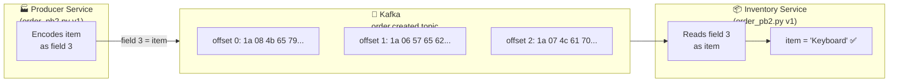
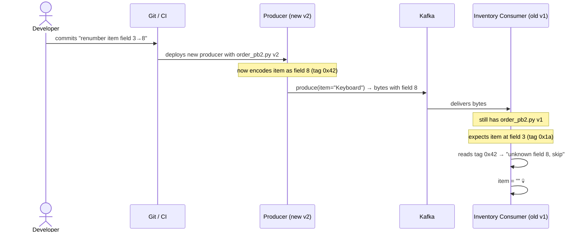
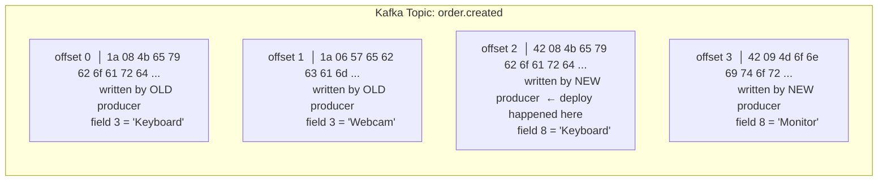
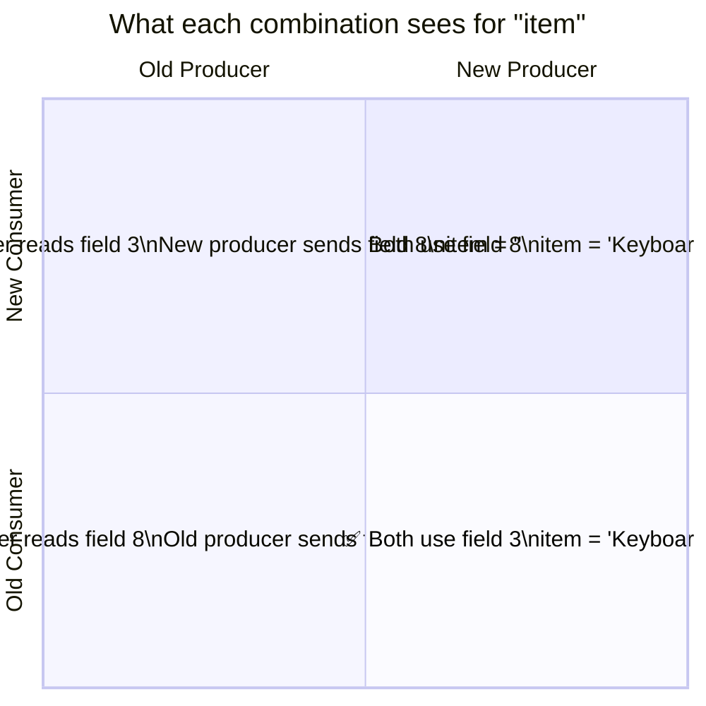
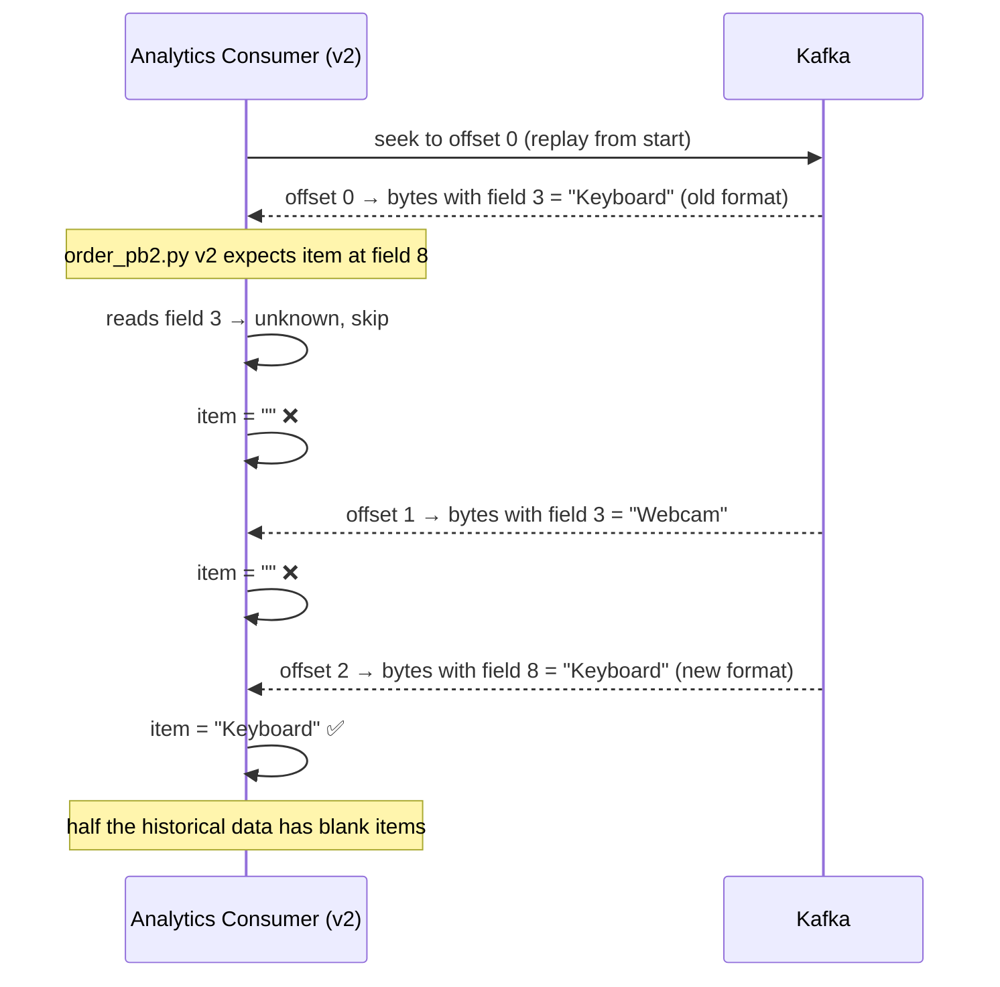
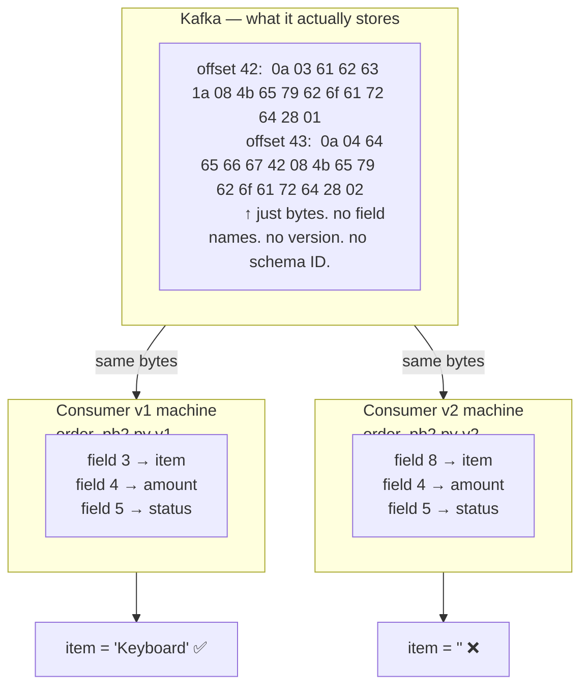
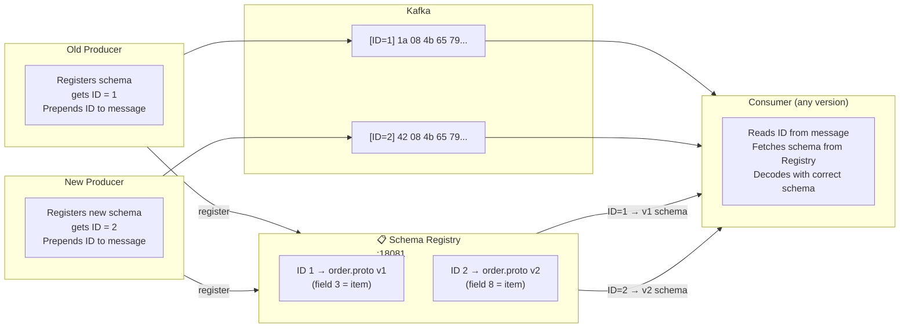
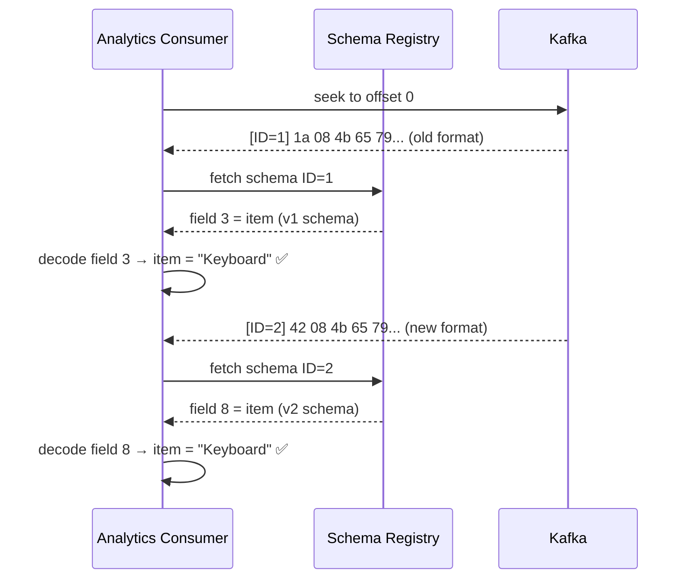
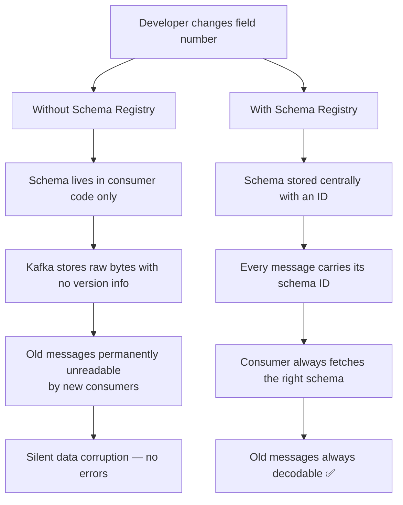

# The Schema Disaster — A Story

> **You are here:** [Index](../README.md) → [Proto Schema](./proto-schema.md) → **The Schema Disaster**

*A story about what happens when a developer changes a field number, why silent corruption is worse than a crash, and how Schema Registry saves the day.*

---

## Chapter 1 — Everything is working

ShipStream is running smoothly. The order pipeline looks like this:



The proto schema is:

```protobuf
message Order {
  string id          = 1;
  string customer_id = 2;
  string item        = 3;   // ← item lives at field number 3
  double amount      = 4;
  OrderStatus status = 5;
}
```

Every order flows through perfectly. `item` is always populated. Life is good.

---

## Chapter 2 — The "innocent" change

A new developer joins the team. They're cleaning up the schema and notice the field numbering looks inconsistent. They decide to renumber `item` from `3` to `8` to "leave room for future fields between 3 and 7."

```protobuf
// BEFORE
string item = 3;

// AFTER — "just a cleanup"
string item = 8;
```

They regenerate `order_pb2.py`, test it locally with a fresh topic, everything passes. They deploy the new producer.



The inventory service is now receiving orders with a blank item. No exception. No alert. No error in the logs. Just empty strings flowing silently into the warehouse system.

---

## Chapter 3 — What Kafka actually stored

This is the moment most people don't realise. Kafka stored the raw bytes from the old producer — bytes that say "field 3 = Keyboard". The new producer is now writing bytes that say "field 8 = Keyboard". **Both exist in the topic simultaneously.**



The topic now has two generations of messages with incompatible field numbering, sitting side by side with no way to tell them apart from the outside.

---

## Chapter 4 — The four combinations

Three hours later, the team deploys the new consumer (with `order_pb2.py v2`). Now the system has a mix of old/new producers and old/new consumers all running at the same time.



There is no deployment order that avoids the broken cells. Deploy new producer first → bottom-right cell is broken. Deploy new consumer first → top-left cell is broken. You are guaranteed data loss during the transition.

---

## Chapter 5 — It gets worse: replaying history

Two weeks later, the analytics team wants to reprocess all orders to rebuild a dashboard. They reset the consumer group offset to `earliest` and replay from offset 0.



Old messages in Kafka are permanent. The new consumer can never correctly read them. The historical data is partially corrupted — forever.

---

## Chapter 6 — The schema lives in the code, not in Kafka

This is the root cause of everything above. Kafka stores raw bytes and nothing else. There is no schema attached to any message.



The schema is a property of the **consumer's deployed code**, not of the message. Two consumers with different `_pb2.py` files will decode the exact same bytes into different results.

---

## Chapter 7 — Enter Schema Registry

Schema Registry solves this by storing the schema centrally and embedding a **schema ID** in every message. Now the bytes carry enough information to know which schema was used to write them.



Every message now carries its schema ID as a 5-byte prefix (1 magic byte + 4 byte ID). The consumer reads the ID, fetches the matching schema from the registry, and decodes using the exact schema the producer used — regardless of what version the consumer itself has deployed.

---

## Chapter 8 — Wire format with Schema Registry

Without Schema Registry, a Kafka message value is just raw Protobuf bytes:

```
Without Schema Registry:
┌─────────────────────────────────────────────┐
│  0a 03 61 62 63  1a 08 4b 65 79 62 6f ...   │
│  └──────────────────────────────────────┘   │
│               raw protobuf bytes            │
└─────────────────────────────────────────────┘
```

With Schema Registry, 5 bytes are prepended:

```
With Schema Registry:
┌────┬────────────────┬─────────────────────────────────────────────┐
│ 00 │ 00 00 00 01    │  0a 03 61 62 63  1a 08 4b 65 79 62 6f ...   │
│ ↑  │ ↑              │  └──────────────────────────────────────┘   │
│magic│ schema ID = 1 │           raw protobuf bytes                │
└────┴────────────────┴─────────────────────────────────────────────┘
```

The consumer reads bytes 1–4 to get the schema ID, fetches schema `1` from the registry, and decodes the rest as Protobuf using that schema.

---

## Chapter 9 — Replaying history with Schema Registry

Now the analytics team resets to `earliest` and replays history again. This time:



Every message decoded correctly, regardless of when it was written or which schema version produced it. Historical replay works perfectly.

---

## The full lesson



---

## Key takeaways

1. **Kafka stores bytes, not schemas.** There is no version tag on any message unless you add one yourself.

2. **The schema is in the consumer's code.** Two consumers with different `_pb2.py` files decode the same bytes differently.

3. **Never change a field number.** It silently corrupts data with no error, affects historical messages permanently, and has no safe deployment order.

4. **Schema Registry** solves this by making every message self-describing — it carries the ID of the schema used to write it.

5. **We're not using Schema Registry yet** — Redpanda exposes it on `:18081` but ShipStream Phase 1 skips it. This is Phase 2 territory.

---

> ← [Previous: Proto Schema](./proto-schema.md) | [Index](../README.md) | [Next: Binary Encoding →](./binary-encoding.md)
