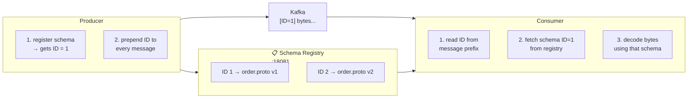

# What is Schema Registry?

> **You are here:** [Index](../README.md) → [Schema Registry](./README.md) → **What is Schema Registry?**

---

## The problem it solves

Kafka stores raw bytes. When a producer serializes an `Order` with Protobuf and writes the bytes to a topic, Kafka has no idea what those bytes mean. It stores them as-is and delivers them to consumers unchanged.

This works fine as long as every producer and every consumer agrees on exactly the same schema. But schemas change. A new field gets added. A field gets renamed. A service gets deployed with the new schema before another service is updated. The bytes in the topic are now being interpreted by two incompatible versions of the schema simultaneously.

The result is [silent data corruption](../protobuf/schema-story.md) — no errors, no alerts, just wrong values.

**Schema Registry solves this by storing schemas centrally and making every message carry a reference to the schema used to write it.**

---

## What it is

Schema Registry is a service that:

1. **Stores schemas** — each schema is assigned a numeric ID
2. **Enforces compatibility** — it rejects new schemas that would break existing consumers
3. **Serves schemas on demand** — consumers fetch the schema for a given ID at runtime



---

## Where Redpanda exposes it

Redpanda ships Schema Registry built-in. No extra service or container needed.

| Interface | Address |
|-----------|---------|
| Internal (container-to-container) | `http://redpanda:8081` |
| External (host machine) | `http://localhost:18081` |

The REST API follows the Confluent Schema Registry spec, so all Confluent-compatible clients (including `confluent-kafka`) work against it unchanged.

---

## Key concepts

**Subject** — the name under which a schema is registered. By convention, Kafka topic schemas use the subject `<topic>-value`. All versions of the `Order` schema for the `order.created` topic are registered under the subject `order.created-value`.

**Schema ID** — a globally unique integer assigned to each registered schema version. IDs are monotonically increasing across all subjects.

**Version** — a per-subject sequence number. Subject `order.created-value` might have version 1, 2, 3... independently of other subjects.

```
subject: order.created-value
  version 1 → global ID 1 → { Order with fields 1-6 }
  version 2 → global ID 2 → { Order with fields 1-7 (added region) }
```

---

## What changes in the pipeline

Without Schema Registry, the pipeline is:

```
Producer → serialize to Protobuf bytes → Kafka → Consumer reads bytes → decode with local _pb2.py
```

With Schema Registry, the pipeline is:

```
Producer → register schema → get ID → prepend ID → Kafka → Consumer reads ID → fetch schema → decode
```

The bytes on the wire are slightly different (5 extra bytes at the front), and both the producer and consumer now talk to the Schema Registry on startup and for each schema lookup.

---

> ← [Previous: Schema Disaster](../protobuf/schema-story.md) | [Part 4 Index](./README.md) | [Next: Wire Format →](./wire-format.md)
