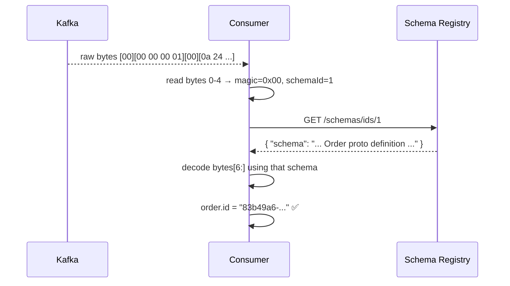

# Wire Format

> **You are here:** [Index](../README.md) → [Schema Registry](./README.md) → **Wire Format**

---

## The 5-byte prefix

When using Schema Registry, every message value starts with a 5-byte Confluent envelope before the Protobuf bytes:

```
┌──────┬──────────────────────┬──────────────────────────────────────────────┐
│  00  │  00  00  00  01      │  0a 24 38 33 62 34 39 61 36 2d ...           │
│  ↑   │  ↑                   │  ↑                                           │
│magic │  schema ID = 1       │  raw Protobuf bytes                          │
│byte  │  (4 bytes, big-endian)│                                              │
└──────┴──────────────────────┴──────────────────────────────────────────────┘
```

- **Byte 0** — always `0x00`. Called the "magic byte". Marks this as a Confluent Schema Registry-encoded message.
- **Bytes 1–4** — the schema ID as a 4-byte big-endian unsigned integer.
- **Bytes 5+** — the actual Protobuf-serialized message, identical to what `SerializeToString()` produces.

---

## A concrete example

Take a simple Order with `id = "abc"`:

**Without Schema Registry:**
```
Offset  Hex   Meaning
0       0a    field 1 (id), wire type 2 (length-delimited)
1       03    length = 3 bytes
2–4     61 62 63   UTF-8 "abc"
...
```

**With Schema Registry:**
```
Offset  Hex         Meaning
0       00          magic byte
1–4     00 00 00 01 schema ID = 1
5       0a          field 1 (id), wire type 2 (length-delimited)
6       03          length = 3 bytes
7–9     61 62 63    UTF-8 "abc"
...
```

The Protobuf bytes themselves are unchanged — the 5-byte prefix is just prepended.

---

## Why this matters

**A raw Protobuf parser will fail on Schema Registry messages.**

If you call `order.ParseFromString(raw_bytes)` on a message that starts with the magic byte `0x00`, Protobuf will try to interpret byte `0x00` as a field tag. Field tag `0x00` is invalid in Protobuf (field number 0 doesn't exist). The result is a parse error or silent corruption.

This is why the consumer must use `ProtobufDeserializer` rather than calling `ParseFromString` directly once Schema Registry is in use.

---

## Protobuf MessageIndex

For Protobuf specifically, there is an additional detail after the 5-byte prefix. The Confluent Protobuf serializer prepends a **MessageIndex** — a variable-length encoding that identifies which message type within the `.proto` file was used. For a `.proto` file with a single top-level message (like `Order`), this is a single byte `0x00`.

```
┌──────┬──────────────────────┬────────┬─────────────────────────────────────┐
│  00  │  00  00  00  01      │  00    │  0a 24 38 33 62 ...                 │
│magic │  schema ID           │  msg   │  Protobuf bytes                     │
│      │                      │  index │                                     │
└──────┴──────────────────────┴────────┴─────────────────────────────────────┘
```

`ProtobufSerializer` and `ProtobufDeserializer` handle this automatically.

---

## How the consumer uses the ID



Schema IDs are cached locally after the first lookup — the round-trip to the registry only happens once per unique schema ID seen.

---

> ← [Previous: What is Schema Registry?](./what-is-schema-registry.md) | [Part 4 Index](./README.md) | [Next: Compatibility Modes →](./compatibility-modes.md)
