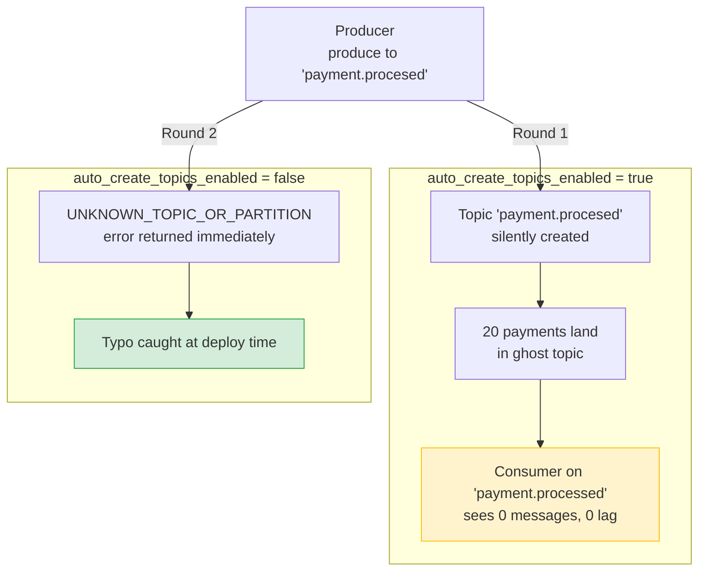
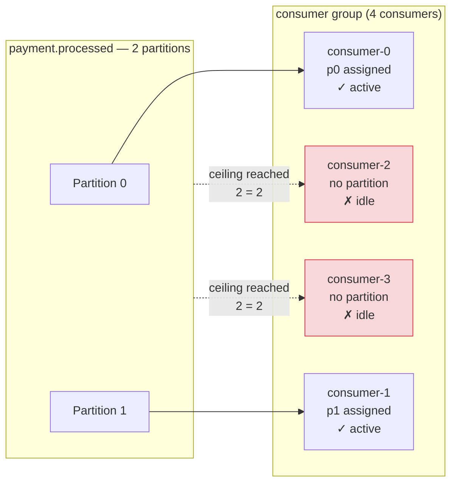
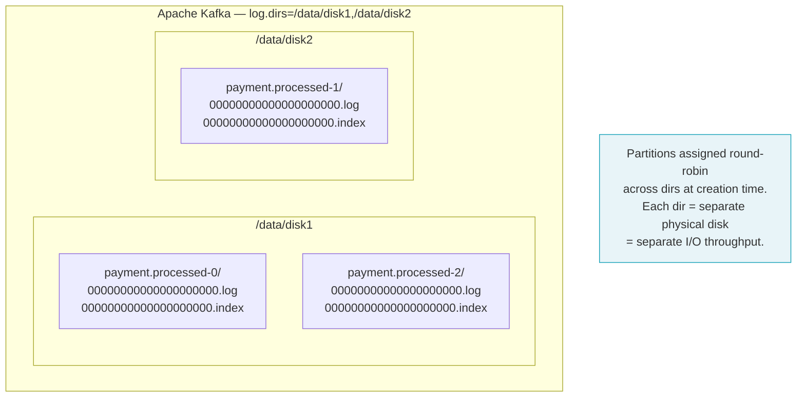
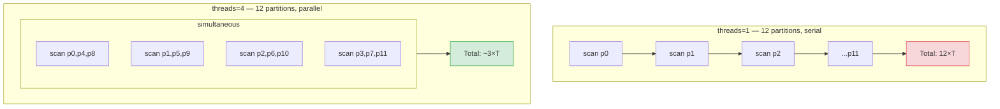

# Simulation Guide — Phase 3: Broker Internals

> **You are here:** [Index](../README.md) → **Phase 3 Simulation Guide**

These simulations use a **payments domain** topic (`payment.processed`) to make the scenarios concrete. Each one targets a specific broker config concept from Part 5 of the knowledge base.

---

## Prerequisites

```bash
# Infrastructure must be running
docker compose up -d

# Verify broker is healthy
docker exec redpanda rpk cluster health
```

---

## S2 — auto.create.topics.enable footgun

**Concept:** [Topic Defaults → auto.create.topics.enable](../kafka/topic-defaults.md)

**What it shows:** A single-character typo in a topic name creates a phantom topic when auto-create is enabled. The real consumer sees zero messages and zero lag — the hardest kind of failure to notice.

```bash
python3 simulations/sim_auto_create_footgun.py
```

**What to look for in the log** (`logs/simulations/auto_create_footgun.log`):

- Round 1: `delivered=20` with no errors, even though the topic didn't exist before the run
- The topic list shows `payment.procesed` (typo) now exists alongside `payment.processed` (correct)
- The consumer group on the correct topic shows no lag — because it received nothing
- Round 2: after disabling auto-create, the same produce call returns an error immediately

**The key insight:** With auto-create on, the failure is invisible at the producer. The data is gone into a topic nobody reads. With auto-create off, the failure is loud and immediate — you catch the typo at deploy time, not hours later.



---

## S3 — num.partitions: consumer parallelism ceiling

**Concept:** [Topic Defaults → num.partitions](../kafka/topic-defaults.md), [Consumer Groups](../kafka/consumer-groups.md)

**What it shows:** Running more consumers than partitions leaves the extras permanently idle. The only way to use them is to increase partition count first.

```bash
python3 simulations/sim_partition_ceiling.py
```

**What to look for in the log** (`logs/simulations/partition_ceiling.log`):

- Round 1 (2 partitions, 4 consumers): two consumers have `[]` in the assigned partitions column, consumed 0 messages
- Round 2 (3 partitions, 4 consumers): three consumers are active, one still idle
- The message counts show consumption was evenly spread across the active consumers



**Why you can't just add consumers:** Kafka's partition assignment is a hard constraint, not a hint. Each partition is owned by exactly one consumer in a group at a time. Adding a fifth consumer to a 4-partition topic gives you one idle consumer with zero impact on throughput. To scale, increase partitions — but do it at topic creation time (see the key ordering note in [Topic Defaults](../kafka/topic-defaults.md)).

---

## S4 — log.dirs: on-disk partition layout

**Concept:** [Topic Defaults → log.dirs](../kafka/topic-defaults.md)

**What it shows:** Each partition is a directory on disk containing segment files. Multiple `log.dirs` paths let Kafka spread partition directories across physical disks for parallel I/O.

```bash
./simulations/sim_log_dirs.sh
```

**What to look for in the log** (`logs/simulations/log_dirs.log`):

- One directory per partition: `payment.processed-0/`, `payment.processed-1/`, `payment.processed-2/`
- Inside each: `.log` (messages), `.index` (offset → file position), `.timeindex` (timestamp → offset)
- The script also shows the hypothetical layout if Kafka had distributed these across two disks



**The retention connection:** Retention deletes entire segment files, not individual messages. A segment can only be deleted once it is closed (the active segment is never deleted). The `log.dirs` layout is where this deletion happens — the broker walks each partition directory, checks timestamps on closed segments, and removes eligible ones. This is covered in [Phase 4](../../PLAN.md).

---

## S5 — Crash recovery: partition count vs recovery time

**Concept:** [Topic Defaults → num.recovery.threads.per.data.dir](../kafka/topic-defaults.md), [Threading Models](../kafka/threading-models.md)

**What it shows:** A hard kill (SIGKILL, equivalent to power loss) followed by restart demonstrates the log recovery process. Three scenarios with increasing partition counts show how recovery work scales, and why `num.recovery.threads.per.data.dir` matters on real Kafka clusters.

> **Warning:** This simulation kills and restarts the Redpanda Docker container. It takes approximately 3–5 minutes to complete all three scenarios.

```bash
./simulations/sim_crash_recovery.sh
```

**What to look for in the log** (`logs/simulations/crash_recovery.log`):

- Each scenario: broker killed mid-write, restarted, timed until healthy
- Recovery time is measured from `docker start` to cluster health reporting `Healthy: true`
- Summary table shows timing for 3 / 12 / 24 partitions

**Why the times may look similar in this environment:**

The `--smp 1` flag in `docker-compose.yml` restricts Redpanda to a single CPU core. With one core, there is no parallelism regardless of partition count. Additionally, the small message volumes (< 1MB per partition) mean recovery scans complete in microseconds — the measured time is dominated by container startup and healthcheck polling interval.

On a real Apache Kafka cluster with `--smp` not being a concern and GB-scale segment files:



**The Kafka analogy from the simulation:**

| Scenario | Partitions | Kafka analogy |
|---|---|---|
| A | 3 | `threads=1` — few dirs, serial is fine |
| B | 12 | `threads=4` — 4 dirs scanned in parallel |
| C | 24 | `threads=8` — 8 dirs scanned in parallel |

**Offset integrity check:** After each recovery, the log confirms that committed messages survived. Any messages in the producer's in-flight buffer at kill time may be lost — they were never acked, so the producer would retry on reconnect. Committed messages are always intact. This is the at-least-once guarantee: **committed = durable**.

---

## Running all Phase 3 simulations

```bash
# S2 — auto-create footgun (< 1 minute)
python3 simulations/sim_auto_create_footgun.py

# S3 — partition ceiling (~2 minutes, starts consumers)
python3 simulations/sim_partition_ceiling.py

# S4 — log dirs (< 1 minute)
./simulations/sim_log_dirs.sh

# S5 — crash recovery (~5 minutes, kills the broker)
./simulations/sim_crash_recovery.sh
```

All logs land in `logs/simulations/`.

---

> ← [S1: Compatibility & Field Deletion](./compatibility-field-deletion.md) | [Index](../README.md)
