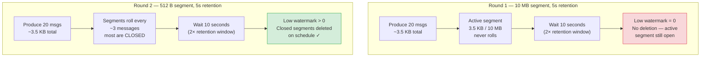
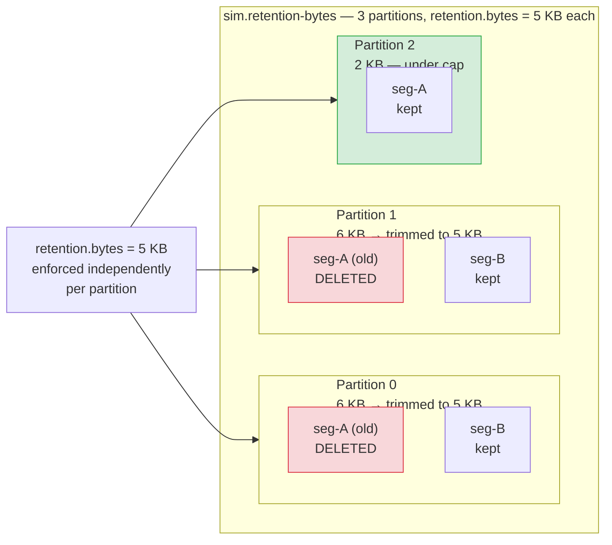
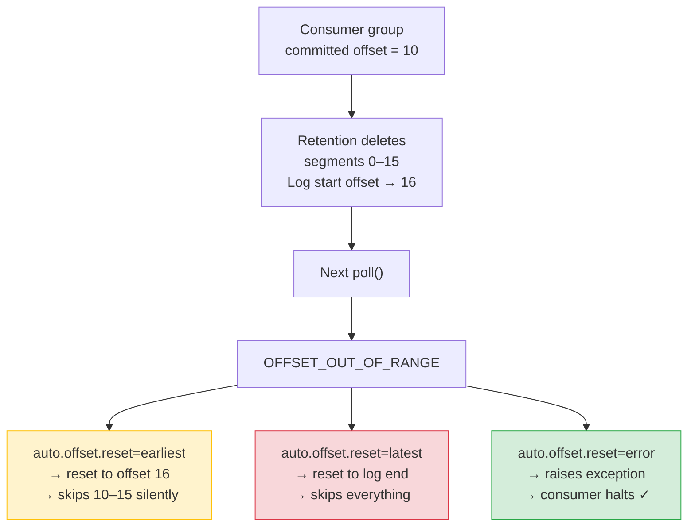

# Simulation Guide — Phase 4: Log Retention & Storage

> **You are here:** [Index](../README.md) → **Phase 4 Simulation Guide**

These simulations use lightweight topics created specifically for each run so they don't interfere with the main `order.created` pipeline. Each one targets a specific concept from [Log Retention & Storage Configuration](../kafka/log-retention.md).

---

## Prerequisites

```bash
# Infrastructure must be running
docker compose up -d

# Verify broker is healthy
docker exec redpanda rpk cluster health
```

---

## S6 — Active segment blocks retention

**Concept:** [log.segment.bytes](../kafka/log-retention.md#logsegmentbytes)

**What it shows:** Retention can only delete **closed** segments. If a low-volume topic never fills its segment, messages inside it will never be deleted — even if they are far past the retention window. This is the most common reason retention appears "broken" in production.

```bash
python3 simulations/sim_segment_roll.py
```

**What to look for in the log** (`logs/simulations/segment_roll.log`):

- Round 1: topic with 10 MB segments and 5-second retention. After 10 seconds, the low watermark is still 0. The active segment never rolled, so nothing was eligible for deletion.
- Round 2: same retention (5 seconds), but segments are 512 bytes. Messages force multiple rolls during produce. After 10 seconds, the low watermark has advanced — old closed segments were deleted on schedule.



**The fix for low-throughput topics:** Set `log.segment.ms` in addition to `log.segment.bytes`. This forces a roll on time, not just size — even if the segment never fills up.

```properties
log.segment.bytes=268435456   # 256 MiB
log.segment.ms=3600000        # force roll after 1 hour regardless of size
```

---

## S7 — log.retention.bytes: per-partition size cap

**Concept:** [log.retention.bytes](../kafka/log-retention.md#logretentionbytes)

**What it shows:** `log.retention.bytes` is a **per-partition** cap, not a per-topic cap. A 3-partition topic with `retention.bytes=5KB` can hold 15 KB total. When one partition overflows its cap, only that partition's oldest segments are deleted — the others are untouched.

```bash
python3 simulations/sim_retention_bytes.py
```

**What to look for in the log** (`logs/simulations/retention_bytes.log`):

- Round 1: 100 messages across 3 partitions (~6 KB per partition, over the 5 KB cap). After 15 seconds, all three partitions show advanced low watermarks — each was independently trimmed.
- Round 2: 30 messages routed to the same partition via a fixed key. Only that partition overflows its cap. Only that partition's low watermark advances; the others stay unchanged.



**Capacity planning formula:**

```
total disk per topic  = partitions × retention.bytes
total disk per broker = Σ (partitions × retention.bytes) × replication_factor
```

---

## S8 — Log start offset and OFFSET_OUT_OF_RANGE

**Concept:** [The log start offset and what happens when data is gone](../kafka/log-retention.md#the-log-start-offset-and-what-happens-when-data-is-gone)

**What it shows:** When a consumer group's committed offset falls below the log start offset (because the segments containing those offsets were deleted), the next `poll()` returns an `OFFSET_OUT_OF_RANGE` error. The three `auto.offset.reset` policies handle this very differently — and choosing the wrong one leads to silent data loss.

```bash
python3 simulations/sim_log_start_offset.py
```

**What to look for in the log** (`logs/simulations/log_start_offset.log`):

- Step 1: 30 messages produced. Three consumer groups each consume and commit offset 10.
- Step 2: 12 seconds pass. Log start offset advances past offset 10. Committed offsets are now below the log start offset.
- Step 3: Three resume attempts, one per reset policy:
  - `earliest` — silently resumes from the new log start offset, skipping deleted messages with no error
  - `latest` — jumps to the tip of the log, skipping everything
  - `error` — raises an exception; consumer halts



**Production recommendation:** Use `auto.offset.reset=error` for any pipeline where missing messages is unacceptable (payments, orders, audit logs). Silent resets with `earliest` or `latest` mean silent data loss — the consumer moves on, lag disappears, and nothing alerts you that events were skipped.

**With tiered storage this problem goes away.** Old segments uploaded to S3 before local deletion mean the log start offset on local disk is no longer the true earliest offset. Consumers can still read offset 10 — the broker fetches it from S3 transparently.

---

## Running all Phase 4 simulations

```bash
# S6 — segment roll blocks retention (~30 seconds)
python3 simulations/sim_segment_roll.py

# S7 — per-partition retention.bytes cap (~40 seconds)
python3 simulations/sim_retention_bytes.py

# S8 — log start offset and OFFSET_OUT_OF_RANGE (~35 seconds)
python3 simulations/sim_log_start_offset.py
```

All logs land in `logs/simulations/`.

---

> ← [Phase 3: Broker Internals](./phase3-guide.md) | [Index](../README.md)
